# Secret-key Encription Seed Labs Guide
## LOGBOOK 10

### Setup
In this lab, since we will only be doing tasks #1 through #3, we don't need to run any containers. We just need to download the files and run the commands in the VM.

### Task 1: Frequency Analysis
In this task, we are going to manually decipher text encrypted using a monoalphabetic substituition cipher. It is most definitely not secure, as it can be subject to this technique, frequency analysis. In fact, this type of cipher means that each letter in the original alphabet is always replaced by another same letter. As an example: "a" could be replaced by "v" in all of its ocurrences.

This means that the frequency of "v" in the cipher text is the same as the frequency of "a" in the original text. This is the basis of frequency analysis.

We know that the original text was written in english, so we can use well-known frequency tables to help us decipher the text.

In the guide, there is a specification of how to randomize the sample and associate each letter with another one. We understood what it was doing, but, as explained in the guide, did not need to use it since there was already an available cipher text for us to use.


#### How to replace the letters
There are two files we'll be using: `freq.py` to get the frequency of n-grams (sequences of n letters) and `ciphertext.txt` which contains the cipher text.

We started by checking the cipher text and then running the `freq.py` script to get the frequency of n-grams. We used the following command:
```bash
python3 freq.py
```
This script reads the file `ciphertext.txt` and outputs the frequency of n-grams in the text. The output is shown here:

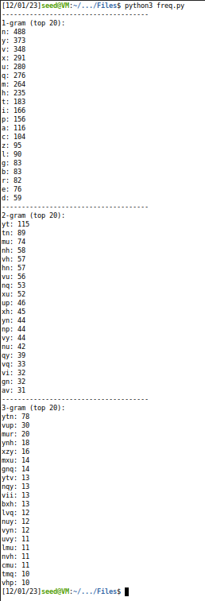

In order to replace the "encrypted" letters by the original letters, we can use the following command, as explained in the guide.
```bash
tr 'abc' 'DEF' < in.txt > out.txt
```
This command replaces the letter "a" by the letter "D", "b" by "E" and "c" by "F". We have to do this for all the letters in the alphabet, after identifying which letters correspond to which. We are going to replace lowercase letters by uppercase, so it is easier to identify which letters correspond to the original alphabet.


Since this command using the same file (as input and output) did not work, we used two files `out1.txt` and `out2.txt` to store the intermediate output of the commands, keeping the `ciphertext.txt` file intact.

#### Decrypting the text
After checking the output from `freq.py`, we realized that the most frequent 3-gram is `ytn`. In english, it corresponds to `the` as seen [here](https://en.wikipedia.org/wiki/Trigram). We can use this information to replace the letters in the cipher text. We started by replacing "ytn" by "THE". We used the following command:
```bash
tr 'ytn' 'THE' < ciphertext.txt > out1.txt
```
After this, we checked that the second most common 3-granm was `vup`, which we thought was `and`. We also saw several instances of `THvT`, which made us believe `v` was indeed `A` and `vup` `AND`. We can use the following command to replace the corresponding letters in the cipher text:
```bash
tr 'vup' 'AND' < out1.txt > out2.txt
```

We continued to do this, from now on mostly analyzing the text, but also checking the frequency of n-grams. We saw that `mN` was a common 2-gram, which we thought was `IN`. We used the following command to replace the letters:
```bash
tr 'm' 'I' < out2.txt > out1.txt
```

We continued to do this, marking each letter we had already found (e.g. `THE` marks letter `T`, `H` and `E` as found). This helps in not making mistakes when replacing the lower case letters.
Here is a complete list of the commands we used to replace the letters:

```bash
tr 'ytn' 'THE' < ciphertext.txt > out2.txt
tr 'vup' 'AND' < out2.txt > out1.txt
tr 'm' 'I' < out2.txt > out1.txt
tr 'r' 'G' < out1.txt > out2.txt
tr 'glf' 'BWV' < out2.txt > out1.txt
tr 'q' 'S' < out1.txt > out2.txt
tr 'hb' 'RF' < out2.txt > out1.txt
tr 'izx' 'LUO' < out1.txt > out2.txt
tr 'aec' 'CPM' < out2.txt > out1.txt
tr 'duv' 'YNA' < out1.txt > out2.txt
tr 'p' 'D' < out2.txt > out1.txt
tr 'ks' 'XK' < out1.txt > out2.txt
tr 'jo' 'ZQ' < out2.txt > out1.txt
tr 'w' 'J' < out1.txt > out2.txt
```

Running this and checking the output, the text is completely deciphered.
Here is a screenshot of the output:

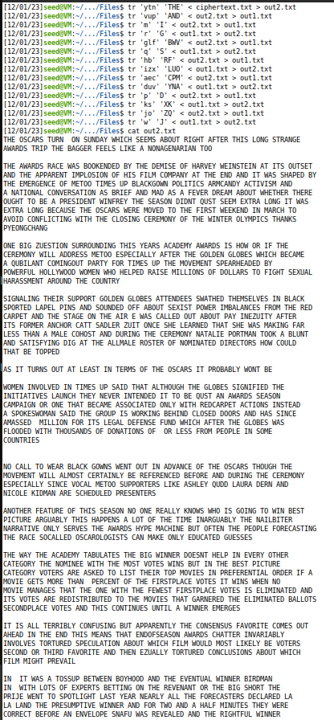

We conclude that the letters in the encrypted text translate to this:
```
abcdefghijklmnopqrstuvwxyz      # encrypted
CFMYPVBRLZXWIEQDSGKHNAJOTU      # decrypted
```

### Task 2: Encryption with different ciphers and modes
In this task, we are going to encrypt a file in plain text using different ciphers and modes.

We started by checking the manuals to find different cipher types by doing `man openssl` and `man enc`.

As reference in the guide, we can find all of the suported cipher types in `man enc`. We found the following in the "Supported Ciphers" section:

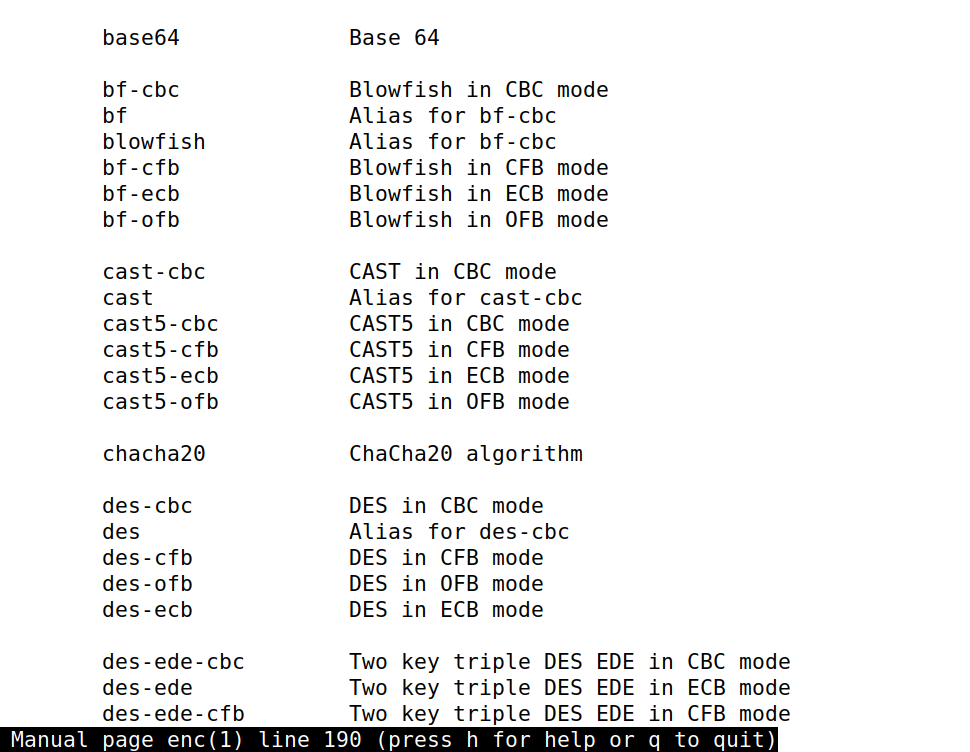

We can also do this by running the following command:
```bash
openssl enc -ciphers
```
This is the output:
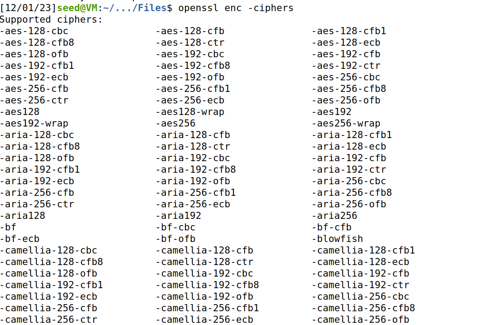


#### Encrypting
We simply created a file with the text `Hello World!`, `plain.txt`.
```bash
echo "Hello World!" > plain.txt
```
This is the file that we will be encrypting.

In general, we will be using the following command to encrypt:
```bash
openssl enc -ciphertype -e -in plain.txt -out cipher.bin -K 00112233445566778889aabbccddeeff -iv 0102030405060708
```

#### 1.1 Using AES-256-ECB
Encrypt using:
```bash
openssl enc -aes-256-ecb -e -in plain.txt -out cipher.bin -K 00112233445566778889aabbccddeeff
```
Decrypt using:
```bash
openssl enc -aes-256-ecb -d -in cipher.bin -out decrypted.txt -K 00112233445566778889aabbccddeeff
```
We use `-e` to encrypt and `-d` to decrypt, giving the correct files as input and output. We also use `-K` to specify the key.

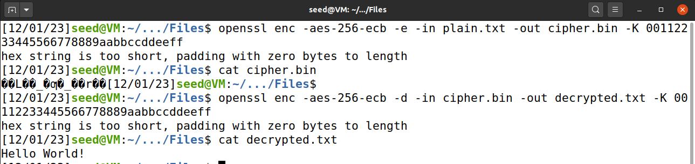
When encrypting and decrypting, we can see that there is a message "hex string is too short, padding with zero bytes to length" in the output.

This is because the key is too short for the encryption used. We can see that the key is 32 characters long, which is 128 bits. This is not enough for AES-256, which requires a 256-bit key. Therefore, the key is padded with zeros to make it 256 bits. In a real scenario, we would use a key with the correct length, but for this lab, we will let this pass.


We use the same key for encryption and decryption, or else we would not be able to decrypt the file, as seen here:

Using the wrong key results in this:
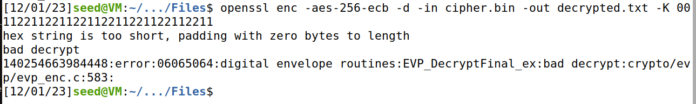

#### 1.2 Using AES-128-CBC
Encrypt using:
```bash
openssl enc -aes-128-cbc -e -in plain.txt -out cipher.bin -K 00112233445566778889aabbccddeeff -iv 0102030405060708
```
Decrypt using:
```bash
openssl enc -aes-128-cbc -d -in cipher.bin -out decrypted.txt -K 00112233445566778889aabbccddeeff -iv 0102030405060708
```

Again, we use `-e` to encrypt and `-d` to decrypt, giving the correct files as input and output. We also use `-K` to specify the key and `-iv` to specify the initialization vector, which is needed in CBC mode.

The decrypted text is the same as the original text, as expected.

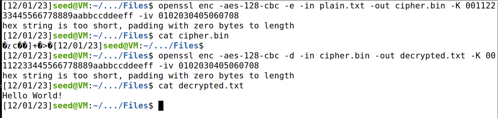


#### 1.3 Using AES-128-CFB

Encrypt using:
```bash
openssl enc -aes-128-cfb -e -in plain.txt -out cipher.bin -K 00112233445566778889aabbccddeeff -iv 0102030405060708
```

Decrypt using:
```bash
openssl enc -aes-128-cfb -d -in cipher.bin -out decrypted.txt -K 00112233445566778889aabbccddeeff -iv 0102030405060708
```
This is the result:

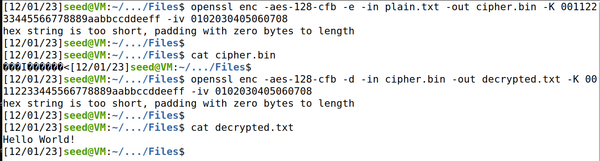

#### 1.4 Using BF-CBC
To encrypt:
```bash
openssl enc -bf-cbc -e -in plain.txt -out cipher.bin -K 00112233445566778889aabbccddeeff -iv 0102030405060708
```
To decrypt:
```bash
openssl enc -bf-cbc -d -in cipher.bin -out decrypted.txt -K 00112233445566778889aabbccddeeff -iv 0102030405060708
```
This is the result:

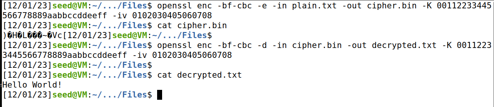

#### Conclusions
We learned how to encrypt and decrypt a file using different ciphers and modes (that may require different input) by using the `openssl` command.

### Task 3: Encryption mode - ECB vs. CBC
In this task, we are going to be comparing encryption in these different modes, Electronic Code Book (ECB) and Cipher Block Chaining (CBC). We will be encrypting the same files (pictures) in both modes and then comparing the results.

As specified in the guide, after encrypting the picture, we need to set the correct header information, so it can be displayed using an image display program. We can do this by copying the header from the original image and then copying the body from the encrypted image. We can use the following commands to do this:
```bash
head -c 54 p1.bmp > header  # p1.bmp original image
tail -c +55 p2.bmp > body   # p2.bmp encrypted image
cat header body > new.bmp   # new.bmp encrypted with correct header
```
We'll use the `eog` command to display the image, as seen below:
```bash
eog new.bmp
```
After understanding how the process works, we start by viewing the original image.

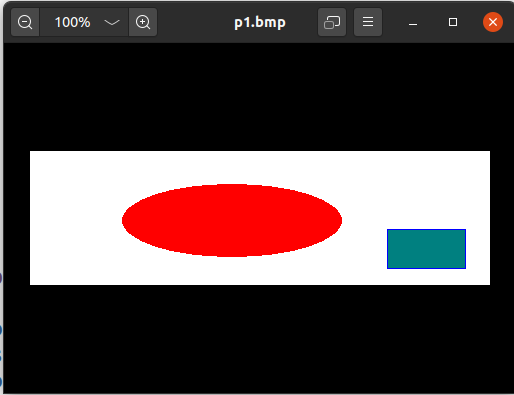

#### ECB
Now, we can encrypt the image using ECB. We are going to be using the `aes-128-ecb` cipher, although we could use any `ecb` cipher. We can use the following command to do this:
```bash
openssl enc -aes-128-ecb -e -in p1.bmp -out p2.bmp -K 00112233445566778889aabbccddeeff  # encrypt p1.bmp to p2.bmp
head -c 54 p1.bmp > header
tail -c +55 p2.bmp > body
cat header body > new.bmp
eog new.bmp     # view encrypted image
```

Here is the encrypted image:

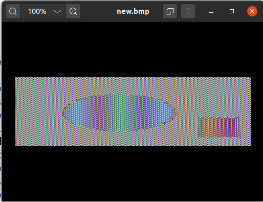

From the theoretical classes, we already knew that with a certain type of block ciphers, it is possible to see patterns of the original image in the encrypted image. This is the case with ECB. We can see the pattern of the original image, although it is a bit distorted.

#### CBC
Now, we can encrypt the image using CBC. We are going to be using the `aes-128-cbc` cipher, although we could use any `cbc` cipher. We can use the following command to do this:
```bash
openssl enc -aes-128-cbc -e -in p1.bmp -out p2.bmp -K 00112233445566778889aabbccddeeff -iv 0102030405060708  # encrypt p1.bmp to p2.bmp
head -c 54 p1.bmp > header
tail -c +55 p2.bmp > body
cat header body > new.bmp
eog new.bmp     # view encrypted image
```
Using this cipher, we are not expecting a pattern to be visible. This is the case, as we can see in the following image:

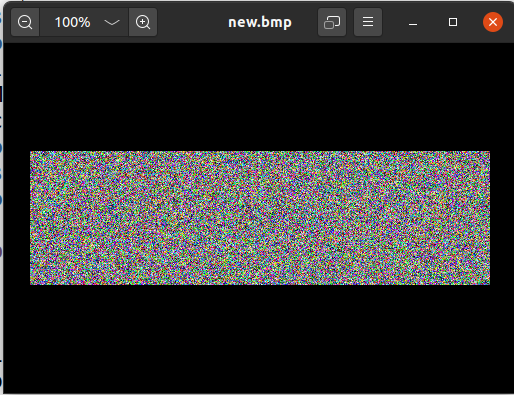


#### Conclusions
We can see that the two modes are very different. ECB is not secure, as we can see the pattern of the original image. On the contrary, CBC is indeed secure. The main difference is the usage of the initialization vector in the CBC, and that blocks depend on each other.

Basically, we can conclude that the output from ECB is more predictable and the output from CBC is less predictable.

#### Testing with our own image
We chose this image to test out:


This image is a .png file, so we converted it to a .bmp file using the following command:
```bash
mogrify -format bmp own_image.png
```
This allowed us to open it using `eog`, as shown here:

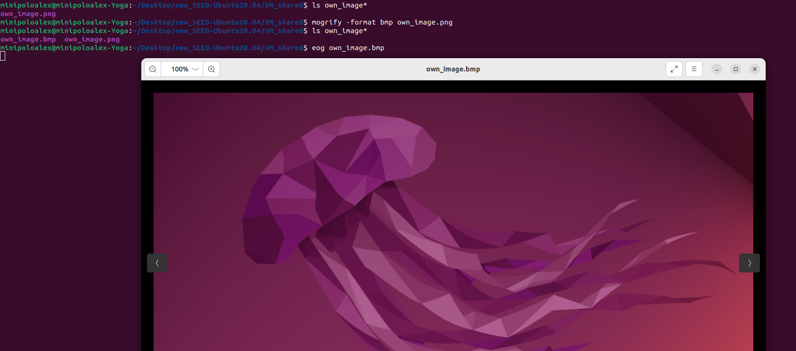

We accessed it through the VM and encrypted it using the same commands as before, but using our image as input instead of the other image.

Using `CBC`, the result is similar. With the encrypted image, we cannot deduce anything from the original image.
```bash
openssl enc -aes-128-cbc -e -in own_image.bmp -out p2.bmp -K 00112233445566778889aabbccddeeff -iv 0102030405060708  # encrypt own_image.bmp to p2.bmp
head -c 54 own_image.bmp > header   # include own_image.bmp header
tail -c +55 p2.bmp > body           # include encrypted image body
cat header body > new.bmp
eog new.bmp     # view encrypted image
```
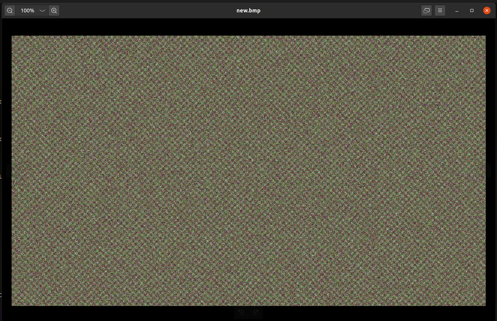

Using `ECB`, however, the result was different from the previous image.
```bash
openssl enc -aes-128-ecb -e -in own_image.bmp -out p2.bmp -K 00112233445566778889aabbccddeeff   # encrypt own_image.bmp to p2.bmp
head -c 54 own_image.bmp > header   # include own_image.bmp header
tail -c +55 p2.bmp > body           # include encrypted image body
cat header body > new.bmp
eog new.bmp     # view encrypted image
```
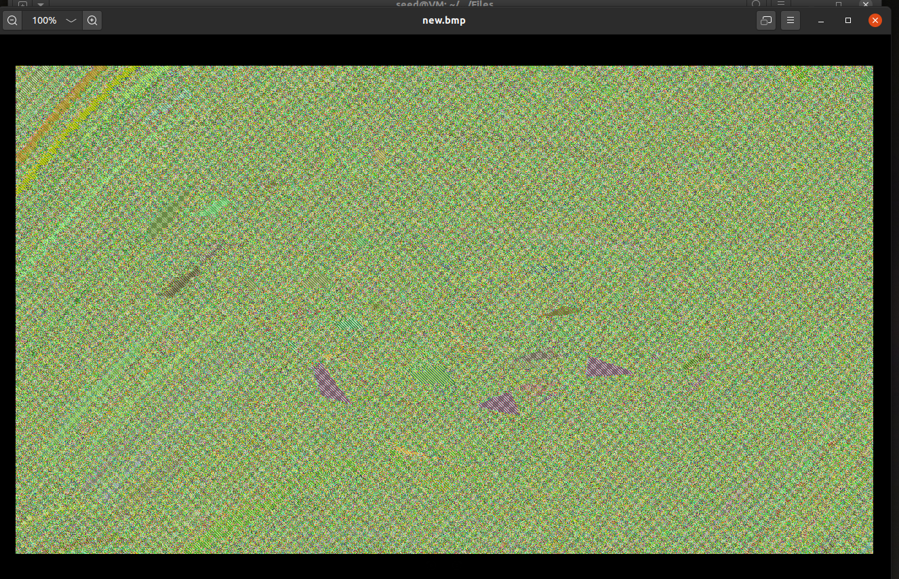

In fact, we cannot deduce all the information about the first image, at least at first glance. However, we can see that it is not as safe as CBC. We can see that the image is distorted, but it is not just random noise. It is possible to detect some patterns, although by simply looking we cannot easily connect them to the original image.

Comparing to the image given before, we can conclude that, since this image has a lot more colors, the pattern is less distinguishible. The previous image had only a few colors, so it was easier to see the pattern. In fact, ECB encrypts a given color the same way everytime. However, with different colors it encrypts to totally unrelated different colors, even if the original colors are very close. This is why we can see the complete pattern in the previous image, but not in this one.
