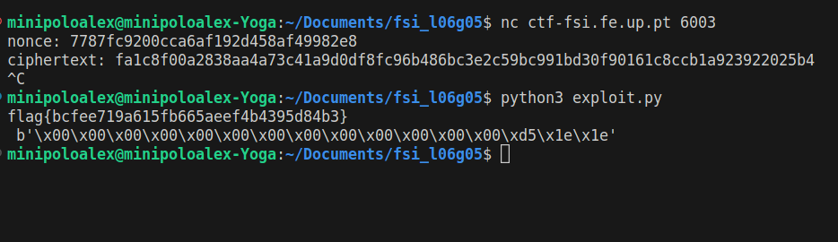

# Weak Encryption

## CTF LOGBOOK 10


### Understanding cipherspec.py
Starting out, we tried to understand what the functions inside the file do.

Looking at the functions given, it is obvious one is for encryption, one for decryption and one to generate a key.


Now, looking at individual pieces of code, we can try to understand better the encryption/decryption algorithm and how the key is generated.


#### Encryption/Decryption
```python
def enc(k, m, nonce):
	cipher = Cipher(algorithms.AES(k), modes.CTR(nonce))
	encryptor = cipher.encryptor()
	cph = b""
	cph += encryptor.update(m)
	cph += encryptor.finalize()
	return cph

def dec(k, c, nonce):
	cipher = Cipher(algorithms.AES(k), modes.CTR(nonce))
	decryptor = cipher.decryptor()
	msg = b""
	msg += decryptor.update(c)
	msg += decryptor.finalize()
	return msg
```
We can see that the encryption and decryption functions are very similar, and they both use the algorithm AES and mode CTR. The parameters passed to these functions are the private key `k`, the message (plain text `m`) or the cipher text `c` and the `nonce`.

We can conclude that, in order to encrypt or decrypt a message, we can just call `enc(k, m, nonce)` or `dec(k, c, nonce)` with the correct parameters, respectively.

Looking at these functions, we cannot see any imediate vulnerabilities or any signs of weak encryption.

#### Key generation
```python
KEYLEN = 16

def gen(): 
	offset = 3 # Hotfix to make Crypto blazing fast!!
	key = bytearray(b'\x00'*(KEYLEN-offset)) 
	key.extend(os.urandom(offset))
	return bytes(key)
```
We can see that `KEYLEN = 16`, which is the key length in bytes. This is the same as 16 * 8 = 128 bits, which is the number necessary for safety in AES.
It may look like this is enough, but there is a problem.

We can see that the key is generated with the first `KEYLEN - offset` bytes with the value `0x00`. This is a "red flag", since these values should all be random. In fact, only `offset` bytes are actually random, and `offset = 3`.

This means that the only variation of the key is in the last 3 bytes, meaning that only 3 * 8 = 24 bits actually may change in the key.

This is not enough, since there are only `2^24` possible keys (24 bits), which is relatively small in terms of computing power.


2^24 ~= 17 million keys, which we can do with a brute force attack

Even a normal computer can brute force this key, since 17 million is not a lot for a computer (1 GHz = 1e9 Hz)

Therefore, we may test all the keys from 0 to 2^24 - 1 (inclusive), and check if the decrypted text contains the flag.


## Exploit
We can copy the decrypt function from the file that is given to us, and then use it to decrypt the ciphertext with all the possible keys. We can check if the decrypted text contains "flag", and if it does, we print it. We also printed the key used to encrypt, even though it is not needed.

We can do this with the following script `exploit.py`:

```python
from cryptography.hazmat.primitives.ciphers import Cipher, algorithms, modes
from cryptography.hazmat.backends import default_backend
from binascii import unhexlify


def dec(k, c, nonce):
    backend = default_backend()
    cipher = Cipher(algorithms.AES(k), modes.CTR(nonce), backend=backend)
    decryptor = cipher.decryptor()
    msg = b""
    msg += decryptor.update(c)
    msg += decryptor.finalize()
    return msg

def main():
    with open('cipher', 'rb') as f:
        ciphertext = unhexlify(f.read().strip())
    with open('nonce', 'rb') as f:
        nonce = unhexlify(f.read().strip())	# remove \n
    for i in range(2**24):
        key = i.to_bytes(16, byteorder='big')	# byteorder does not matter since we are traversing every value
        m = dec(key, ciphertext, nonce)
        if b'flag{' in m:
            print(m.decode('utf-8'), key)

main()
```
We used `unhexlify`, as suggested in the moddle assignment, to convert the input hexadecimal strings into the bytes array.

We tested running this with values given from the server, obtained by running.
```bash
nc ctf-fsi.fe.up.pt 6003
```
We copied the values of the nonce and the cipher text, and pasted them into the files `nonce` and `cipher`, respectively.

We ran our file by doing:
```bash
python3 exploit.py
```
But it was slow (the encryption algorithm is not instantaneous).

To make sure that our script was working, we thought of making a test with a smaller key. Our idea was to simulate a small key, encrypt a string `flag_placeholder` with an arbitrary nonce and that key, and then run the script with the ciphertext and nonce, checking if it finds our plain text message.

However, while working on making a test with a smaller key, we left the script running and it found the flag.

We can see that here:



We copied the nonce and the ciphertext to our files `nonce` and `cipher` and ran the python `exploit.py` script.

We were able to get the flag and the weak cipher was surpassed.

<!--
Deves começar por investigar o ficheiro cipherspec.py e compreender o que está de errado na forma como estes algoritmos estão a cifrar.
De seguida deves responder às seguintes questões:

    Como consigo usar esta ciphersuite para cifrar e decifrar dados?
        - by calling enc() and dec() functions with the correct parameters
    Como consigo fazer uso da vulnerabilidade que observei para quebrar o código?
        - the key is only changed in the last 3 bytes, so we can brute force it
    Como consigo automatizar este processo, para que o meu ataque saiba que encontrou a flag?
        - we can build a python script that traverses all keys possible and tries decrypting the cipher. It will print the flag when it finds it.


Exploring the code, we found that the number of possible keys is very small. This should be at least 128 bits, looking at openssl enc --ciphers | grep aes.*ctr (and also from the theoretical slides).
relevant results:
-aes-128-ctr
-aes-192-ctr
-aes-256-ctr

KEYLEN is 16 bytes, which is equivalent to 16 * 8 = 128 bits.
So it may look like it is enough. However, the problem is that only the last "offset" bytes are actually changed.
In the python script, offset = 3, meaning that only 3 * 8 = 24 bits actually may change in the key.
This is not enough, since there are only 2^24 possible keys, which is very small in computing power.

2^24 ~= 16 million keys, which we can do with a brute force attack


So, we may test all the keys from 0 to 2^24 - 1, and check if the decrypted text contains the flag.
We can do this with the following script:

We can copy the decrypt function from the file that is given to us, and then use it to decrypt the ciphertext with all the possible keys. We can check if the decrypted text contains "flag", and if it does, we print it.

```python
from cryptography.hazmat.primitives.ciphers import Cipher, algorithms, modes
from cryptography.hazmat.backends import default_backend
from binascii import unhexlify


def dec(k, c, nonce):
    backend = default_backend()
    cipher = Cipher(algorithms.AES(k), modes.CTR(nonce), backend=backend)
    decryptor = cipher.decryptor()
    msg = b""
    msg += decryptor.update(c)
    msg += decryptor.finalize()
    return msg

def main():
    with open('cipher', 'rb') as f:
        ciphertext = unhexlify(f.read().strip())
    with open('nonce', 'rb') as f:
        nonce = unhexlify(f.read().strip())	# remove \n
    for i in range(2**24):
        key = i.to_bytes(16, byteorder='big')	# byteorder does not matter since we are traversing every value
        m = dec(key, ciphertext, nonce)
        if b'flag' in m:
            print(m.decode('utf-8'))

if __name__ == '__main__':
    main()
```


We tested running this with values given from the server, obtained by running
```bash
nc ctf-fsi.fe.up.pt 6003
```
But it was slow (the encryption algorithm is not instantaneous)

However, while trying to make a test with a smaller flag, we left the script running and it found the flag.

So we tried doing this with a flag of our own (flag_placeholder), a small flag easier to find, and it worked.

We had to encrypt this flag with the encrypt function given before, with the nonce and key we were testing.

nonce = 1234567890123456
key = 1234
c = encrypt(key, nonce, b'flag_placeholder')

Then we ran the script with the ciphertext obtained, and it worked.
-->
