# PKI Seed labs guide
## Logbook for the public key infraestructure lab

### Setup
We started by running the docker container with the following commands:
```bash
dcbuild
dcup
```
#### DNS Setup
We need to setup the DNS server to resolve the domain names we are going to use in this lab.
We are going to add these 2 entries to the `/etc/hosts` file in the VM, which is the file that maps hostnames to IP addresses.
```
10.9.0.80 www.bank32.com
10.9.0.80 www.dfm2023.com
```
To do this, we can simply run the following command:
```bash
sudo gedit /etc/hosts
```
And add the entries to the end of that file.

### Objective
In this lab, we are going to create digital certificates, by becoming a Certificate Authority (CA) and signing certificates.

## Task 1
We are going to become a root CA and generate a certificate for that CA, a self-signed certificate. A root CA's certificate is unconditionally trusted and is usually pre-loaded into the operating system or browsers, as specified in the guide. In our case, we will have to later manually add the CA's certificate to the browser's trusted certificates (Task 4).

In this task, we are just going to generate the certificate and key files for the root CA.

As referenced in the guide, we need a configuration file, that is going to be used by three OpenSSL commands: `ca`, `req` and `x509`. We will use these commands in this lab.

Looking at the configuration file given in the guide and some suggestions, we can conclude that it expects that some files exist. Therefore, we can create a directory `demoCA`, another directory inside it `newcerts`, and 2 files inside `demoCA`: `index.txt` and `serial`. As explained in the guide, we can create the `serial` file with the value `1000` and leave the `index.txt` file empty.

```bash
mkdir demoCA
cd demoCA/
mkdir newcerts
echo '1000' > serial
touch index.txt
cp /usr/lib/ssl/openssl.cnf myCA_openssl.cnf
```
The result is here:
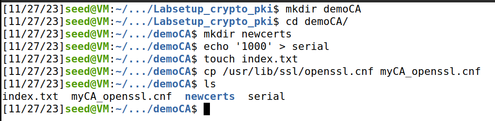

We also had to edit the copied file `myCA_openssl.cnf`, by uncommenting the following line, to allow creation of several certificates with the same subject.
```
unique_subject	= no			# Set to 'no' to allow creation of
					                # several certs with same subject.
```

We can create a self-signed certificate by running the following command:
```bash
openssl req -x509 -newkey rsa:4096 -sha256 -days 3650 -keyout ca.key -out ca.crt
```
We had to specify some information, such as the country, state, city, organization name, organizational unit name, common name and email address. The values and the output of the command are shown in the following screenshot:

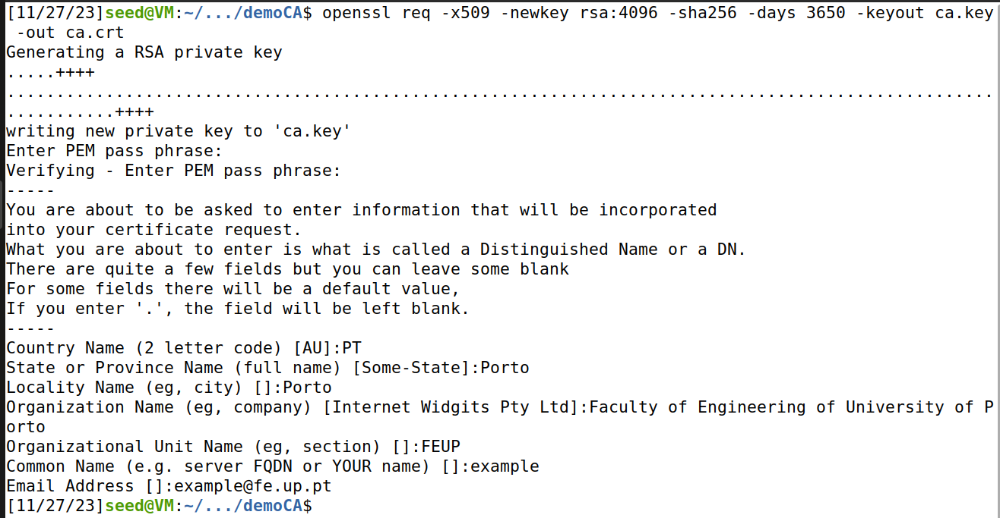
The password we specified was `lab11`.

The results of this command are 2 files: `ca.key` and `ca.crt`. The first is the private key of the CA, and the second one contains the public-key certificate of the CA.

The guide also shows how to specify the parameters through the command line, by running this command:
```bash
openssl req -x509 -newkey rsa:4096 -sha256 -days 3650 -keyout ca.key -out ca.crt -subj "/CN=www.modelCA.com/O=Model CA LTD./C=US" -passout pass:dees
```

We ran this command, replacing our previously generated files, and the result is essentially same, with the password `dees`.

We can print the certificate and the key (decoded), by running these commands:
```bash
openssl x509 -in ca.crt -text -noout    # print the certificate
openssl rsa -in ca.key -text -noout     # print the key
```
In order to print the key, we need to use the password "dees" we specified when generating the key.

We are asked to identify some components/values from these outputs:
- What part of the certificate indicates this is a CA’s certificate?
    - Inside the certificate file `ca.crt`, we can see that the certificate is a CA's certificate, because it includes the following:
```
X509v3 Basic Constraints: critical
    CA:TRUE
```
- What part of the certificate indicates this is a self-signed certificate?

    - Inside the certificate file `ca.crt`, we can see that the issuer and the subject are the same:
```
Issuer: CN = www.modelCA.com, O = Model CA LTD., C = US
...
Subject: CN = www.modelCA.com, O = Model CA LTD., C = US
```
- In the RSA algorithm, we have a public exponent e, a modulus n (also public), a private exponent d, and two secret numbers p and q, such that n = pq.
    - The certificate file `ca.crt` contains the modulus and the public exponent. We can see them both here:

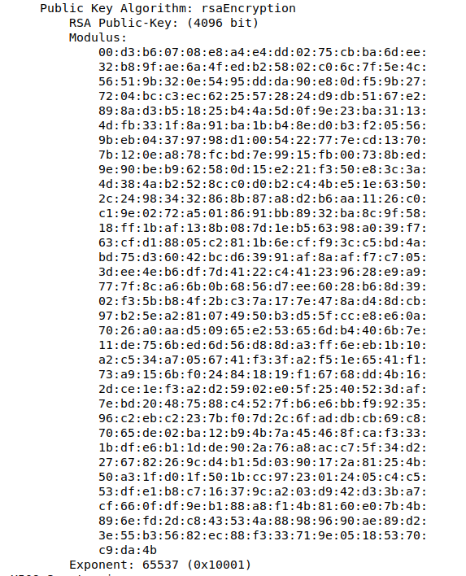

- The key file `ca.key` contains the modulus, the public exponent, the private exponent d, the two primes p and q.

Here there is a screenshot of the modulus and the public exponent, just as the in the certificate file:
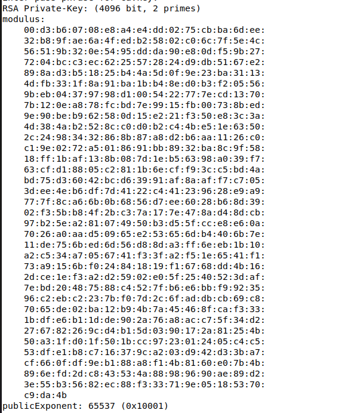

Here is the private exponent, which comes right after the public exponent:
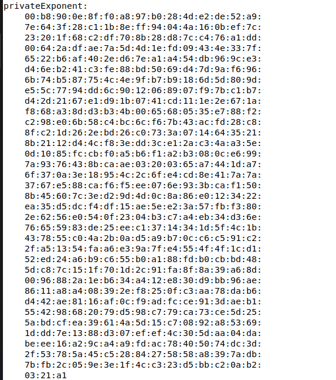

And here are the two primes p and q, located right after the private exponent:
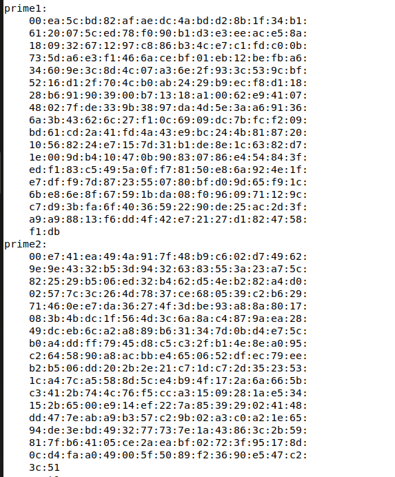

### Task 2
We are going to run the example `bank32.com` website, and only after try our "own" website.

Firsly, we need to generate a Certificate Signing Request (CSR) for the server, which is a request to the CA for it to sign a certificate for the server. We can do this by running the following command:
```bash
openssl req -newkey rsa:2048 -sha256 -keyout server.key -out server.csr -subj "/CN=www.bank32.com/O=Bank32 Inc./C=US" -passout pass:dees
```

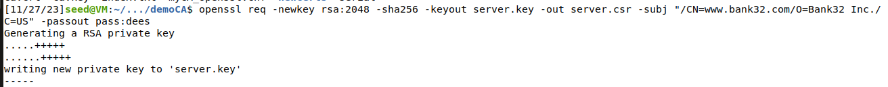

Without the option `-x509`, this generates a CSR (Certificate signing request), instead of generating a self-signed certificate.

It generates a pair public and private key, and creates a signing request for that public key. The private key is stored in the file `server.key`, and the signing request is stored in the file `server.csr`.

To look at the decoded content of the CSR and private key files, we use these commands:
```bash
openssl req -in server.csr -text -noout
openssl rsa -in server.key -text -noout     # password is "dees"
```
<!--TODO: maybe add the output of the commands-->
The output from these commands is similar to those seen before for the CA's certificate and key. The output is large, so it is not shown here for brevity.

#### Adding alternative names
We are asked to add alternative names to the certificate, so that we can access the website using different URLs.

The guide also notes that the common name in a certificate must match the server's hostname, or browsers will refuse communicating with the server.

To allow a certificate to have multiple names, the X.509 specification defines extensions to be attached to certificates. This extension is called Subject Alternative Name (SAN). 

We can do this by adding the option `-addext "subjectAltName = DNS:www.bank32.com, DNS:www.bank32A.com, DNS:www.bank32B.com"` to the `openssl req` command. The resulting command is this:
```bash
openssl req -newkey rsa:2048 -sha256 -keyout server.key -out server.csr -subj "/CN=www.bank32.com/O=Bank32 Inc./C=US" -passout pass:dees -addext "subjectAltName = DNS:www.bank32.com, DNS:www.bank32A.com, DNS:www.bank32B.com"
```

We run this command and the output is similar to before:

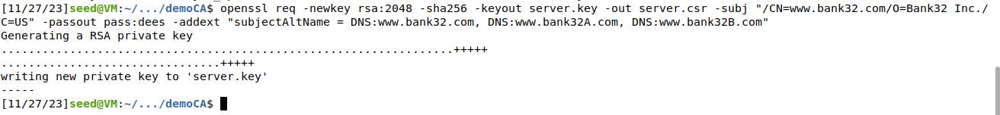

### Task 3
In this task, we want to generate a certificate for the server. We need the CA's signature so that the CSR file can be turned into a certificate. In this lab, we can sign this using our CA, generating a certificate. In the real world, we would send the CSR to a CA, and they would potentially sign it.

We are going to use the `openssl ca` command to sign the CSR. We need to specify the CA's certificate and key, the CSR file to sign, and the output certificate file. We also need to specify the configuration file, which we copied from the `/usr/lib/ssl/openssl.cnf` file and modified.

The following command turns the certificate signing request `server.csr` into an X509 certificate `server.crt`, using the our CA's `ca.crt` and `ca.key`.
This signs that request, accepting it and turning it into a certificate.

```bash
openssl ca -config myCA_openssl.cnf -policy policy_anything -md sha256 -days 3650 -in server.csr -out server.crt -batch -cert ca.crt -keyfile ca.key    # password is "dees", certificate valid for 10 years
```

We use the `policy_anything` defined in the configuration file, so we are not restrictive and allow the request to be accepted, since this policy does not enforce any matching rule.

We had to move all of our working directory to the correct directory. The structure of the directory is shown in the following screenshot:
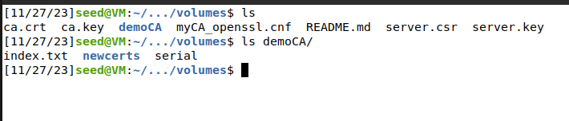


To allow `openssl ca` to copy the extension field from the request to the final certificate, we need to uncomment the following line in the configuration file `myCA_openssl.cnf`:
```
# Extension copying option: use with caution.
copy_extensions = copy
```

Now, we can run the command, and the output is this:

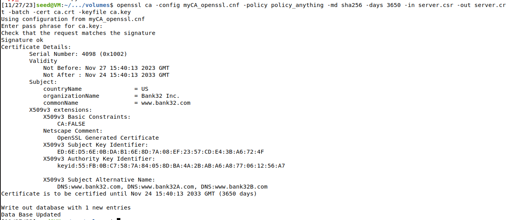

We can print out the decoded content of the certificate, and check whether the alternative names are included, by running this command:
```bash
openssl x509 -in server.crt -text -noout
```
This is the output, and we can see the alternative names in the `X509v3 Subject Alternative Name` section:
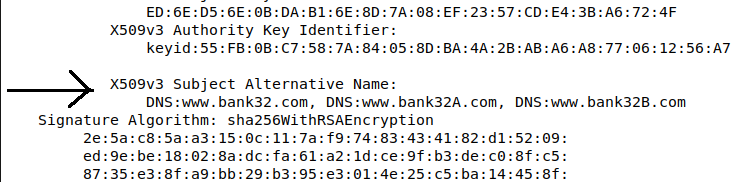

### Task 4
In this task, we are going to run the example website `bank32.com` and access it from the browser. We are also going to use this example to run our own HTTPS website.

To create an HTTPS website using the apache server (already installed in our container), we just need to configure Apache to use the certificate and key files we generated in the previous task.

Inside the container, we can find the Apache configuration files in the directory `/etc/apache2/sites-available`.
The container has the file `bank32_apache_ssl.conf` inside this directory, containing the entry for the example website `bank32.com`, as shown in the guide:


`DocumentRoot` is the directory where the website files are located. In this case, it is `/var/www/bank32.com`.
The `ServerName` specifies the name of the website, and the `ServerAlias` specifies alternative names for the website. The `SSLCertificateFile` and `SSLCertificateKeyFile` specify the certificate and key files, respectively.

In order to make the website work, we need to enable Apache's ssl module and then enable this site.
This can be done with the following commands.
```bash
a2enmod ssl                   # Enable the SSL module
a2ensite bank32_apache_ssl    # Enable the sites described in this file
```

#### Running the example website
The Apache server needs to be manually started (need to input the password to the private key).
We can start it by running `service apache2 start` inside the container.
```bash
service apache2 start
```
We can now access the website from the browser, by typing `https://www.bank32.com` in the browser inside the VM.
<!--TODO: website not secure?-->

#### Running our own website
We are going to run our own website, using the same configuration file as the example website, but with different certificate and key files.

```
cp bank32_apache_ssl.conf dfm2023_apache_ssl.conf
```
We edit the server names, the key and certificate files, so the configuration file looks like this:
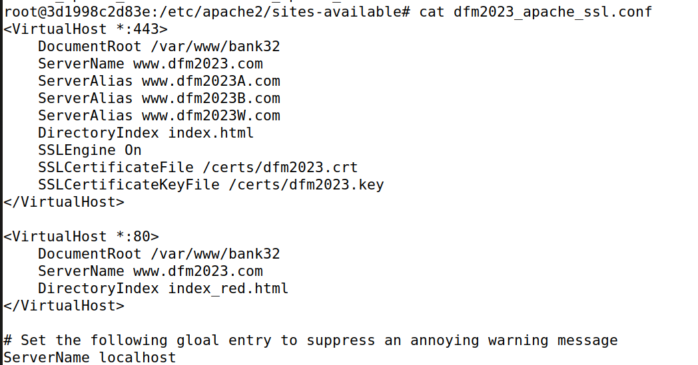

We need to generate a certificate and key for our website, using the same commands as before, but with different names:
```bash
openssl req -newkey rsa:2048 -sha256 -keyout dfm2023.key -out dfm2023.csr -subj "/CN=www.dfm2023.com/O=DFM2023 Inc./C=US" -passout pass:dees -addext "subjectAltName = DNS:www.dfm2023.com, DNS:www.dfm2023A.com, DNS:www.dfm2023B.com"

openssl ca -config myCA_openssl.cnf -policy policy_anything -md sha256 -days 3650 -in dfm2023.csr -out dfm2023.crt -batch -cert ca.crt -keyfile ca.key
```

We copy the certificate and key files to the correct directory:
```
cp dfm2023.crt /certs/dfm2023.crt
cp dfm2023.key /certs/dfm2023.key
```

We can now enable the site and start the Apache server:
```bash
a2ensite dfm2023_apache_ssl
service apache2 start
```

We can now start the Apache server and access the website from the browser, by typing `https://www.dfm2023.com` in the browser inside the VM.
Simply typing http://www.dfm2023.com will result in this, since it is not HTTPS.
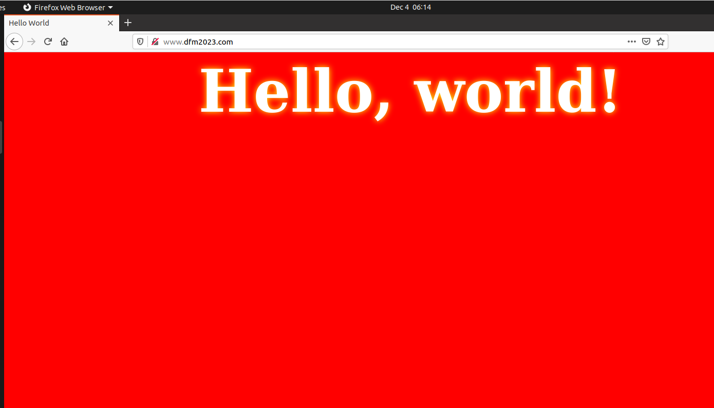

After typing https://www.dfm2023.com, we can see the website, after accepting a warning from the browser, since the certificate is not trusted. This is because the CA's certificate is not in the browser's trusted certificates.

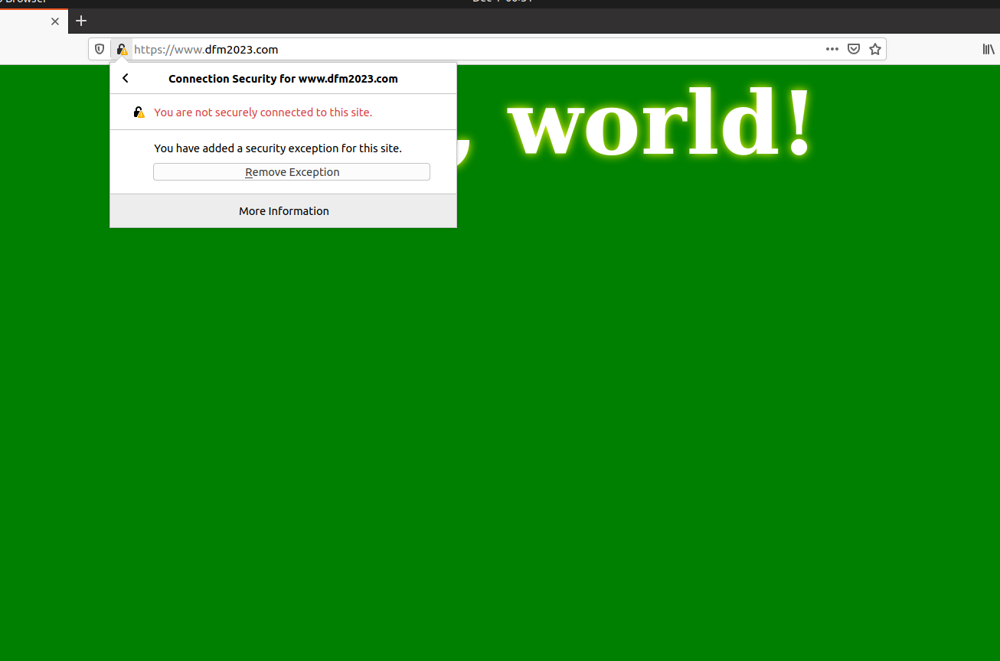

To avoid receiving this warning, we need to add the CA's certificate to the browser's trusted certificates. We can import the CA's certificate into the browser by going to the browser's settings, and importing the certificate from the file `ca.crt`. We can type `about:preferences#privacy` in the URL to access these settings and scroll down to view the certificates section. After clicking on `View certificates`, we can import our own certificate, by clicking on `Import...` and selecting the file `ca.crt`.

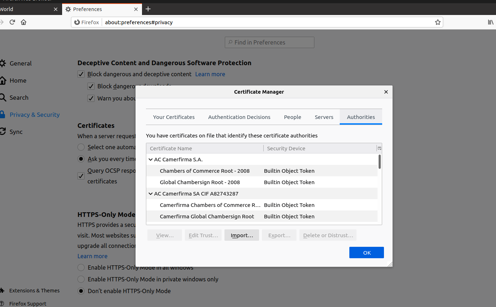

In the Authorities tab, we can select our own CA certificate:

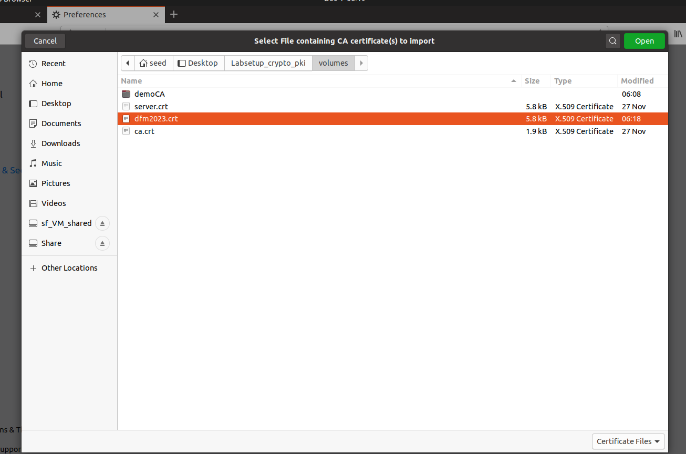

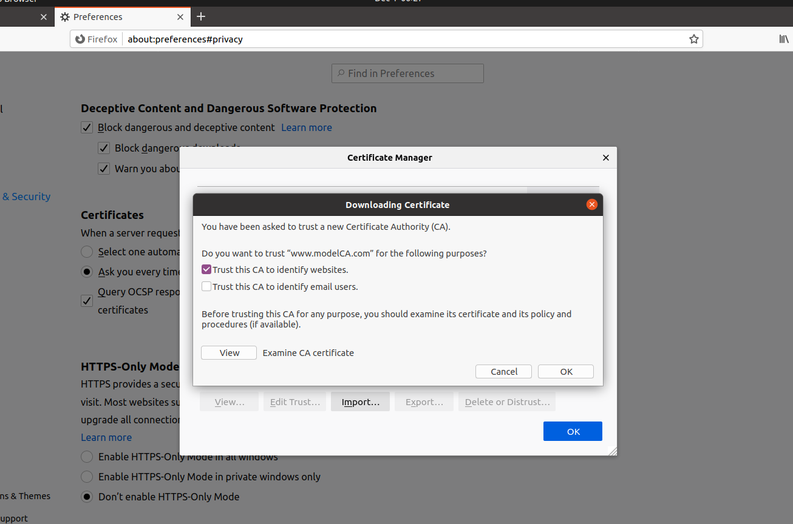

Now since, we have added our own certificate authority, that trusts the certificate of our website, we can access the website without receiving any warnings.

The browser now trusts the certificate of our website, because it trusts the certificate of our CA, which signed the certificate of our website.

We restarted the browser and the apache server, to make sure everything was reloaded, and we had success accessing our website.

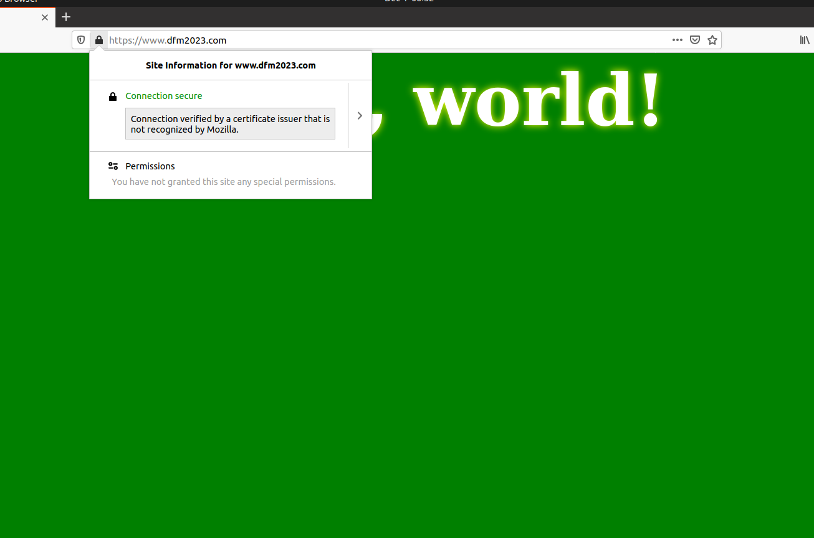

### Task 5

In this task, we are going to setup a man in the middle attack, intercepting the communication between a user and a server.

We are asked to pick a popular site to intercept, and we chose `www.google.com`.

To perform the man-in-the-middle attack, we need to attack either the routing, so the user's HTTPS request is routed to our server, or the DNS, so when the victim's machine tries to find the IP address of the target web server, it finds ours.

In this task, we will simulate the approach of attacking the DNS. We will simply modify the victim machine's `/etc/hosts` file to emulate the result of a DNS cache poisoning attack. We will map the hostname `www.google.com` to our malicious web server.

<!--TODO: remove-->


We can do this in the VM by doing:
```bash
sudo gedit /etc/hosts
```
And adding this entry to the end of the file:
```
10.9.0.80   www.google.com
```
<!--TODO:-->


### Task 6
As specified in the guide, in this task, we assume the attacker has control of the Certificate Authority created in Task 1 and can generate any arbitrary certificate using the CA's private key. Therefore, we will use this to be able to setup the fake target website.

In the first tasks, it is specified that the common name in a certificate must match the server's hostname, or browsers will refuse communicating with the server. So we need to generate the key for this server and cannot use other previously generated keys.

We start by generating a key and a certificate for the fake target website `www.google.com` using the CA. We can do this by running the following command:
```bash
openssl req -newkey rsa:2048 -sha256 -keyout google.key -out google.csr -subj "/CN=www.google.com/O=GOOGLE Inc./C=US" -passout pass:dees -addext "subjectAltName = DNS:www.google.com, DNS:www.googleA.com, DNS:www.googleB.com"

openssl ca -config myCA_openssl.cnf -policy policy_anything -md sha256 -days 3650 -in google.csr -out google.crt -batch -cert ca.crt -keyfile ca.key

cp google.crt /certs/google.crt
cp google.key /certs/google.key
```

We can copy the configuration of our website, changing some values to be for our fake `www.google.com`.
```
cd /etc/apache2/sites-available/
cp dfm2023_apache_ssl.conf google_apache_ssl.conf   # copy
nano google_apache_ssl.conf                         # edit the file
```
We will edit the file so it looks like this:

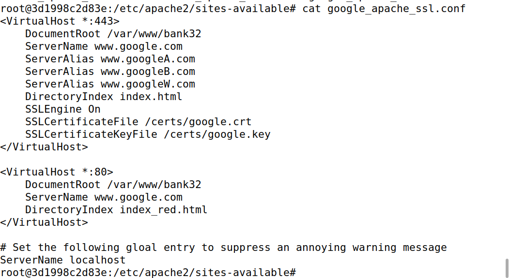

After runnning:
```bash
a2ensite google_apache_ssl
service apache2 reload
```

We can access the website from the browser, by typing `https://www.google.com` in the browser inside the VM.

As we can see the attack is successful, since the browser trusts the certificate of our CA (and therefore our website), and we can access the website without receiving any warnings or errors.

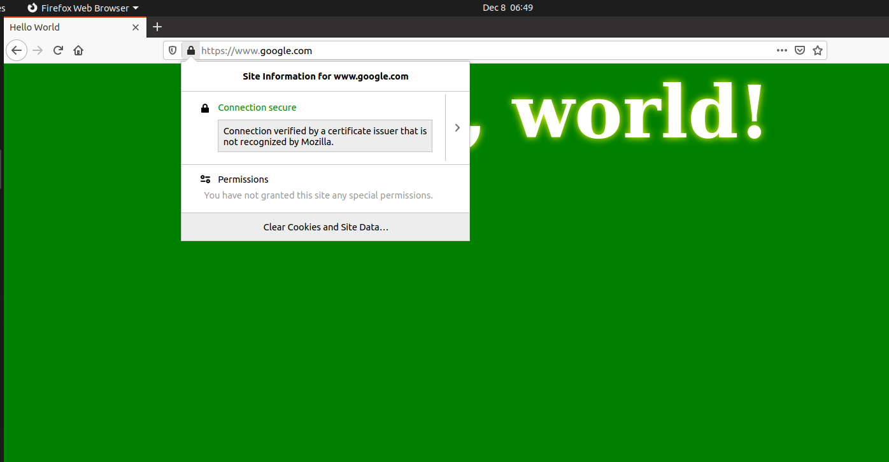
