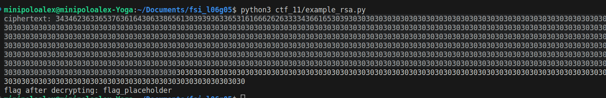
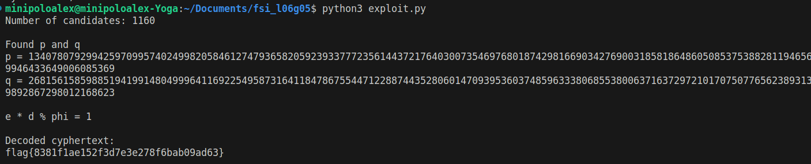
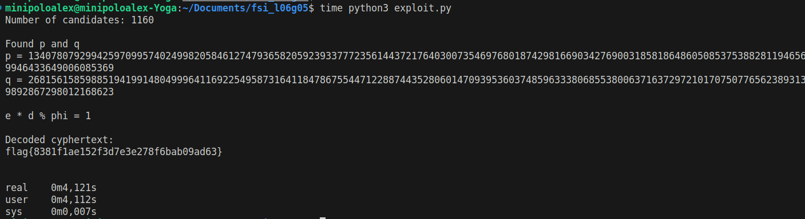

# RSA

## CTF Week 11

### Understanding `challenge.py` 

```python
import os
import sys
from rsa_utils import getParams
from binascii import hexlify, unhexlify

FLAG_FILE = '/flags/flag.txt'

def enc(x, e, n):
    int_x = int.from_bytes(x, "little")
    y = pow(int_x,e,n)
    return hexlify(y.to_bytes(256, 'little'))

def dec(y, d, n):
    int_y = int.from_bytes(unhexlify(y), "little")
    x = pow(int_y,d,n)
    return x.to_bytes(256, 'little')

with open(FLAG_FILE, 'r') as fd:
	un_flag = fd.read()

(p, q, n, phi, e, d) = getParams()

print("Public parameters -- \ne: ", e, "\nn: ", n)
print("ciphertext:", hexlify(enc(un_flag.encode(), e, n)).decode())
sys.stdout.flush()
```

The `challenge.py` file is a simple RSA encryption/decryption program. It takes in a flag file, reads it, and encrypts it using the RSA algorithm. The encrypted flag is then printed out, along with the public parameters used to encrypt it, the public exponent `e` and the modulus `n`.

### Finding primes with Miller-Rabin

We are encouraged to use the Miller-Rabin algorithm to be able to tell if a certain (big) number is a prime or not. The Miller-Rabin algorithm is a probabilistic primality test, which means that it identifies probable primes. It cannot tell us with 100% certainty if a number is prime, but it can tell us with a high degree of certainty. A prime number will always be identified as a probable prime by this algorithm. So, a number may be identified as a probable prime but not be a prime, but a number will never be identified as a non-prime if it is a prime.

We used an already existing implementation of this algorithm from the python library [miller-rabin](https://pypi.org/project/miller-rabin/). This library can be installed using the following command:
```bash
pip3 install miller-rabin
```

### Testing RSA encryption and decryption
We wanted to test the RSA encryption and decryption with our own `p` and `q` values to check that our logic after finding `p` and `q` is correct. So, we wrote a simple RSA encryption and decryption program.

To encrypt, we used the sequence of functions given to us in the `challenge.py` file.
The biggest problem we had was the decryption, meaning how to convert the ciphertext back to a plain text string. We arrived at the following solution:

For the decryption, we can use the opposite functions of the ones used to encrypt, in a reverse order.

This would mean something like this:
```
x is the opposite of c
y is the opposite of b
z is the opposite of a
encrypt a(b(c()))   # a is last to execute
decrypt x(y(z()))   # z is first to execute
```

Following this logic, in the encryption we finish by using `decode`, so to decrypt we start by using `encode`. Applying this, the result is the following:
```python
# To encrypt
ciphertext = hexlify(enc(flag.encode(), e, n)).decode()

# To decrypt
flag = dec(unhexlify(ciphertext.encode()), d, n).decode()
```

And the code we used to test the RSA encryption and decryption is the presented below:
```python
from binascii import hexlify, unhexlify

def gcdExtended(a, b): 
    if a==0:
        return b,0,1   
    gcd,x1,y1=gcdExtended(b%a,a)
    x=y1-(b//a)*x1
    y=x1
    return gcd,x,y

def enc(x, e, n):
    int_x = int.from_bytes(x, "little")
    y = pow(int_x,e,n)
    return hexlify(y.to_bytes(256, 'little'))

def dec(y, d, n):
    int_y = int.from_bytes(unhexlify(y), "little")
    x = pow(int_y,d,n)
    return x.to_bytes(256, 'little')

flag = "flag_placeholder"
# "e" is a prime so it is relatively prime to phi, unless phi is a multiple of 65537 (we checked that it is not)
# "e" and "phi" must be relatively prime (gcd(e, phi) = 1) for the RSA and the extended euclidean algorithm to work
e = 65537
p = 52279468025162057249    # arbitrary big prime
q = 97996887989942852147    # arbitrary big prime
n = p * q
phi = (p-1) * (q-1)
d = gcdExtended(e, phi)[1] % phi

assert (e * d) % ((p - 1) * (q - 1)) == 1

ciphertext = hexlify(enc(flag.encode(), e, n)).decode()


print(f"ciphertext: {ciphertext}")

print(f"flag after decrypting: {dec(unhexlify(ciphertext.encode()), d, n).decode()}")
```
And the output is this:



### The exploit

We have the following information about the primes `p` and `q`:
- `p` is a prime number close to `2^512`
- `q` is a prime number close to `2^513`

We can use this information to find the values `p` and `q` used in the RSA and subsequently decrypt the `ciphertext`.

The difficulty of breaking an RSA encryption algorithm relies on finding the prime factors of `n`. Here is where the information about the values of `p` and `q` comes in handy.

We can brute force `p` by generating a list of primes close to `2^512` and then check if `n` is divisible by it. If it is, we have found `p` and `q` and should be able to decrypt the flag.

Having `p` and `q`, we can calculate `phi = (p-1) * (q-1)` and use the extended euclidean algorithm to find `d`, since we know `e * d (mod phi) = 1`. `d` is the inverse of `e` modulus `phi`.
We can then decrypt the flag using the private exponent `d` and the modulus `n`.


The following is our exploit:

```python
from binascii import hexlify, unhexlify
import miller_rabin as mr   # library

def gcdExtended(a, b): 
    if a==0:
        return b,0,1   
    gcd,x1,y1=gcdExtended(b%a,a)
    x=y1-(b//a)*x1
    y=x1
    return gcd,x,y

def enc(x, e, n):
    int_x = int.from_bytes(x, "little")
    y = pow(int_x,e,n)
    return hexlify(y.to_bytes(256, 'little'))

def dec(y, d, n):
    int_y = int.from_bytes(unhexlify(y), "little")
    x = pow(int_y,d,n)
    return x.to_bytes(256, 'little')

possible_p = []
search_range = 200000

for i in range(2**512, 2**512 + search_range):
    if mr.miller_rabin(i):
        possible_p.append(i)

for i in range(2**512 - search_range, 2**512):
    if mr.miller_rabin(i):
        possible_p.append(i)

e = 65537
n = 359538626972463181545861038157804946723595395788461314546860162315465351611001926265416954644815072042240227759742786715317579537628833244985694861278988163799743225961296402425024098006413694310954069459255494580094261056202454712297765400867297345830934246210993765453286117186090597548401245632339561176887

ciphertext = "6661633538343066346139613261663737666130383461373034363739323662396436316165373835326138363464326265636133343633366232663137346339613934616634366435386666663465323037643766373833386164343563366631646561646532613733636431653233356434323132643764373963346563356230623938373839323933326434646163623033643637366461393663376230313734373162303830636135623761326130376363613731623961386164323163353135346234376137343162373766666564363530376634663235643531666639646462396539636663653232313261336239306363643335653433616430313030303030303030303030303030303030303030303030303030303030303030303030303030303030303030303030303030303030303030303030303030303030303030303030303030303030303030303030303030303030303030303030303030303030303030303030303030303030303030303030303030303030303030303030303030303030303030303030303030303030303030303030303030303030303030303030303030303030303030303030303030303030303030303030303030303030303030303030303030303030303030303030303030303030303030303030303030303030303030303030303030303030303030303030303030"

p = q = -1
print(f"Number of candidates: {len(possible_p)}\n")

for i in possible_p:    # brute force p (close to 2**512)
    if n % i == 0:  # if n is divisible by i, we have found p and q
        p = i
        q = n // i    # q is the other factor of n
        break

assert p != -1 and q != -1
assert p * q == n

print("Found p and q")
print(f"p = {p}")
print(f"q = {q}\n")

phi = (p - 1)*(q - 1)
d = gcdExtended(e, phi)[1]  # (gcd=1, x, y) => x * e + y * phi = 1 <=> x * e = 1 (mod phi) <=> x = d
print(f"e * d % phi = {e * d % phi}\n") # should be 1

print("Decoded cyphertext:")
flag = dec(unhexlify(ciphertext.encode()), d, n).decode()
print(flag)
```

The exploit is pretty simple. We first generate a list of possible primes `p` in the range `2^512` to `2^512 + 200000` and `2^512 - 200000` to `2^512`. The miller-rabin primality test is used to check if a number is prime and, therefore, to obtain the list of primes.

We then check if `n` is divisible by any of the primes in the list. If it is, we have found `p` and subsequently `q`, since `q = n // p`. This means that we have access to the private values of the RSA and should be able to decrypt `ciphertext`. We then calculate `phi`, and use the extended euclidean algorithm to find `d`. Finally, we decrypt the cyphertext using `d` and `n`.

We can run this using the following command:
```bash
python3 exploit.py
```
The code takes just a few seconds to run, and the flag is printed out at the end. The output is this:



We timed the program to see how long it takes to run.



Note that the chosen range of primes is arbitrary. We can choose a larger range if we want to, but it will take longer to run. We can also choose a smaller range, but there is a chance that we will not find `p`.
