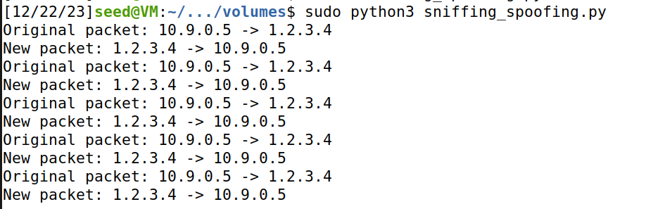

# Seed Labs Guide
## LOGBOOK for the sniffing and spoofing guide

### Setup
Since we need 3 machines in this guide, we will be using 3 containers to run this lab: `attacker`, `hostA`, and `hostB`. These will be connected to the same LAN.

To build and run a container, we can do:

```bash
dcbuild
dcup
```

We will need to insert code inside the attacker container. We can easily do this using the `volumes/` folder in the VM, that is shared between the VM and the container.
The following entry in the dockerfile handles this:

```
volumes:
- ./volumes:/volumes
```

Since containers have a limited view of the network traffic, we need to use `host mode` for the attacker container. The following entry is necessary to allow the it to see all traffics.

```
network_mode: host
```

This makes the container have the same IP address as the host VM, putting it in the same network space as the VM.

To get the network interface for the VM, we can run:

```bash
ifconfig
```

We know that the ip address assigned to the VM is `10.9.0.1`, so we can look for it in the results.
We find this:


Alternatively, since the network interface is `br-` concatenated with the network id, we could also run this to find the network id:

```bash
docker network ls
```

Which would result in this:


Therefore, we infer that the resulting network interface is `br-9b97557cdc9c`.

### Using Scapy to Sniff and Spoof Packets

For this lab, we'll be using Scapy in each task to sniff and spoof packets.

#### Task 1: Sniffing packets
We start by trying to understand the program that is given to us. As explained, it "sniffs" the packets from the given network interface, effectively printing information about each packet received in that interface. Additionally, it filters them so that it only prints "ICMP" packets.

##### Task 1.A
We copied the program and ran it in the VM with sudo permissions by doing:

```bash
sudo python3 sniff.py
```

We did not get any output. We had to ping the VM so that it received packets. We did this by getting inside one of the containers and running the following command inside that container:

```bash
# Get inside the container
dockps
docksh 21949

# Inside the container
ping 10.9.0.1   # ping the VM
```

This resulted in the following output:


The output on the python program:


We can see both the request and the reply, as well as information about the packets.

The first packet is the request (echo-request), the second the reply (echo-reply).

For both types of packets, we can see the MAC addresses at the top of each packet in the Ethernet section, some information about the IP, namely the version (IPv4), the protocol used, and the IP addresses. Finally, we can also see the type of the ICMP message in the ICMP section and the raw data at the end.

Therefore, we can conclude that we were able to view the information about the packets received by the VM.

If we had simply ran:
```bash
python3 sniff.py
```
We would have gotten the following error:


This is basically saying that we do not have permissions to sniff packets, which is because, in this case, we did not run the program with sudo/root permissions.

##### Task 1.B

In this task we want to use the Berkeley Packet Filter syntax to set filters in our sniffing program. This makes us only sniff packets that match the filter, i.e. packets that we are interested in.

#### ICMP packets

We could see that the previous program was filtering for only ICMP packets. So, the result is already presented before.

#### TCP packets

We now want to capture any TCP packet that comes from a particular IP, let's say `10.9.0.5`, since this was the IP of the container that we previously used to ping the VM. The packets to capture must also have destionation port number 23.

We found information about how to build a Berkeley Packet Filter online. The resulting filter was `tcp and dst port 23 and src host 10.9.0.5` and we changed the program to use this filter.

```python
pkt = sniff(iface='br-9b97557cdc9c', filter='tcp and dst port 23 and src host 10.9.0.5', prn=print_pkt)
```

Since ping issues ICMP packets, we will not be able to do the same as in the previous task. We will need to use a different program to send TCP packets to the VM.

In this case, we will use `telnet`. It is a protocol that allows remote access to computers and networks based on TCP.

Firstly, we start the sniffing program by running:

```bash
sudo python3 sniff.py
```

Then, we connect to the container and send TCP packets to the VM:

```bash
# Enter the container
dockps
docksh 21949

# Inside the container
telnet 10.9.0.1     # connect to the VM with TCP
```

To connect to the VM using telnet, we also need to input the username and password for the VM, which are `seed` and `dees` respectively.

We can see the output of the telnet program here:


And the output of the sniffing program here (since the output is very large, only a section is shown):


We can see that the protocol is indeed TCP.

#### Packets from particular subnet

We will pick the subnet given in the guide, `128.230.0.0/16`, and we will capture any packets that come from this subnet (or those which are sent to it).

To do this, we need to build another Berkeley Packet Filter. The resulting filter was `net 128.230.0.0/16`. If we ping this subnet from the container, we should be able to see the packets inside the sniffing program (running on the VM).

We changed the program to use this new filter.

```python
pkt = sniff(iface='br-9b97557cdc9c', filter='net 128.230.0.0/16', prn=print_pkt)
```

To run the program, we do:

```bash
sudo python3 sniff_1b_subnet.py
```

Then, we connect to the container again and run this command inside it:

```bash
ping 128.230.0.1
```

This command pings an arbitrarily chosen IP address inside the subnet (any valid IP address inside the subnet will do).

The output of the ping is shown here:


The output of the sniffing program is shown here:
| Echo request example | Echo reply example |
| :-:| :-:|
|  |  |

We can see the `echo-request` and `echo-reply` messages, sent to the subnet and received from it, respectively.

#### Task 1.2: Spoofing ICMP packets

##### Trying the program

We start by trying to understand the program that is given to us.

```python
from scapy.all import *
a = IP()            # create an IP object
a.dst = '10.9.0.5'  # set the destination IP address
b = ICMP()          # create an ICMP object
p = a/b             # stack a and b to form a new object (adds "b" as the payload field of "a")
send(p)             # send the packet denoted by the object p

# To print the values of the fields of the packet, we can use `ls(p)`
ls(p)
```

Firstly, as explained in the guide, we should turn on WireShark to see the packets sent/received.

Then, we can try this program by running:

```bash
sudo python3 spoof.py
```

The output of the python program is this, showing the values of the fields of the packet:


And we can see the packets with the expected IP addresses in Wireshark:


Indeed, we sent an ICMP packet from the VM `10.9.0.1` to `10.9.0.5`.

Note that we turned WireShark on the interface`br-9b97557cdc9c`.

##### Spoofing the packet

Spoofing the packet means changing the source IP address of the packet. We can do this by changing the `src` field of the IP object.

The resulting program is this:

```python
from scapy.all import *

a = IP()                # create an IP object
a.src = '128.230.0.1'   # spoof packet
a.dst = '10.9.0.5'      # set destination
b = ICMP()              # create an ICMP object
p = a/b                 # build packet
send(p)                 # send packet

ls(p)                   # print packet fields
```

We can run it by doing:

```bash
sudo python3 spoof.py
```

The output of the python program is this:


We can see that the source IP address is what we set it too, so the packet has been successfully spoofed.

The output in Wireshark is this:


It demonstrates that the packet was successfully sent to the destination IP address with the spoofed source IP address.

We can also see that the container with the IP address `10.9.0.5` replied with a packet to the spoofed IP address `128.230.0.1`. This container was where we sent our spoofed packet.

#### Task 1.3: Traceroute

The objective of this task is to use Scapy to estimate the distance between the VM and a selected destionation, in terms of number of routers the packet has to pass through to get to the destination.

This is basically what `traceroute` does. We will be writing our own tool to mimic this.

As explained in the guide, the idea is to start with the Time-To-Live (TTL) field set to 1, and then increase it by 1 until we get a response from the destination. Once we get that response, we know that the current TTL is the number of routers between the VM and the destination.

That is because the TTL field is decremented by 1 each time the packet passes through a router (or a second passes, but that is irrelevant nowadays). When it reaches 0, the packet is "discarded". So, when the TTL is 1, the packet will be dropped by the first router, and the router will send a message back to the VM. When the TTL is 2, the packet will be dropped by the second router, and so on. This means that when `TTL = n` and we get a response from the router with the expected IP address, we know that the distance is `n`.

<!--
 When the TTL reaches 0, the packet is discarded, and typically, an Internet Control Message Protocol (ICMP) Time Exceeded message is sent back to the source indicating that the packet was discarded due to TTL reaching zero.
-->

The guide also denotes that this is an estimation, since the packets many not always be sent through the same path.

We can easily understand the example code that is given in the guide:
```python
a = IP()            # create an IP object
a.dst = '8.8.8.8'   # example destination IP address (we will calculate the distance to this IP address)
a.ttl = 3           # the TTL field (we should start this at 1 and increment it by 1 until we get a response)
b = ICMP()          # create an ICMP object
send(a/b)           # send the packet
```

We can build a python program to execute this procedure automatically, although we will need to add some extra code to handle the responses.

The resulting program is this:

```python
from scapy.all import *

limit = 30
for i in range(1, limit + 1):
    a = IP()            # create an IP object
    a.dst = '8.8.8.8'   # an example IP address
    a.ttl = i
    b = ICMP()          # create an ICMP object
    send(a/b)
```


We can run the program by doing:

```bash
sudo python3 traceroute.py > traceroute_out.txt &   # run on background and save output to file in case we want to check it later
```

We can look at Wireshark and find out if we were able to successfully determine the distance to the destination.

At first, we had a problem where we were not able to get any response from the destination. We only got responses from some intermediates, but at a certain point no more responses.


Testing with the actual `traceroute` program on the VM resulted in asterisks `*`. This means that the packets were not able to reach the destination. Traceroute is able to handle this, but our program is not.

We searched how to fix this problem, but after connecting to FEUP's VPN, we were able to get responses from the destination. We used `8.8.8.8` as the target.

The output in Wireshark is this:


We can conclude that the distance is 21, since the packet with `ttl=21` is the first that gets a response and not a `Time-to-live exceeded` message.

We wanted to build a better program, more similar to `traceroute`. We ended up doing this:

```python
from scapy.all import *

def traceroute(target, max_hops=30):
    for ttl in range(1, max_hops + 1):
        packet = IP(dst=target, ttl=ttl) / ICMP()

        # Send the packet and wait for a response (or timeout)
        reply = sr1(packet, verbose=0, timeout=1)

        if reply is None:
            # No response, print an asterisk (*)
            print(f"{ttl}. *")
        elif reply.haslayer(ICMP) and reply.getlayer(ICMP).type == 11:
            # ICMP Time Exceeded message received, print the responding IP
            print(f"{ttl}. {reply.src}")    # intermediate router
        elif reply.haslayer(ICMP) and reply.getlayer(ICMP).type == 0:
            # ICMP Echo Reply received, we reached the destination
            print(f"{ttl}. {reply.src} (Reached destination)")        # final router (destination)
            break
        else:
            # Other types of ICMP messages, print the responding IP
            print(f"{ttl}. {reply.src}")

destination_ip = "8.8.8.8"
traceroute(destination_ip)
```

And the output from running it is:


We can see the intermediate routers and the final destination. It allows us to determine the number of hops necessary to get to the destination, which is 21 as seen before on Wireshark.

### Task 1.4: Sniffing and Spoofing

The objective of this task is to sniff a packet from the VM and then spoof it and send it back to the container that initally sent it.

In the container with IP address `10.9.0.5`, we will be pinging some IP addresses. Our program running on the VM will sniff these packets and send replies to the container. Therefore, regardless of the pinged IP address, the container will always receive a reply, spoofed by the VM. From the point of view of the container, those IP addresses exist and belong to valid machines.

In the container, we will be pinging the following IP addresses:

```
ping 1.2.3.4    # non-existing host on the Internet
ping 10.9.0.9   # non-existing host on the LAN
ping 8.8.8.8    # existing host on the Internet
```

The code we built for the program running on the VM is this:

```python
from scapy.all import *

def spoof_pkt(pkt):
    print(f"Original packet: {pkt[IP].src} -> {pkt[IP].dst}")
    ip = IP(src=pkt[IP].dst, dst=pkt[IP].src, ihl=pkt[IP].ihl)
    icmp = ICMP(type=0, id=pkt[ICMP].id, seq=pkt[ICMP].seq)
    data = pkt[Raw].load
    newpkt = ip/icmp/data
    print(f"New packet: {newpkt[IP].src} -> {newpkt[IP].dst}")
    send(newpkt, verbose=0)

pkt = sniff(iface='br-9b97557cdc9c', filter='icmp and src host 10.9.0.5', prn=spoof_pkt)
```

We can enter the container:

```bash
dockps
docksh 21949
```

Start the program:

```bash
sudo python3 sniffing_spoofing.py
```

And then ping the IP addresses inside the container:

```bash
ping 1.2.3.4
ping 10.9.0.99
ping 8.8.8.8
```

The output for the first ping is this:


On the VM, the output from the python program is this:



---

The ping to `10.9.0.99`, however, is not successful. This is because the IP address does not exist in the LAN, so the packet is not sent to the VM. Therefore, the VM does not sniff it and does not send a reply to the container.

So, there is no output on the VM. The container shows this:


The last ping, to `8.8.8.8`, results in the container receiving duplicate packets. This is because the VM is sniffing the packets and sending replies, but the container is also receiving replies from the actual host. So, it receives two replies for each ping.

The output on the VM from our program is this:


It shows that our python program is sending replies to the container.

The output on the container from `ping` is this:


This shows that there are duplicate replies for each ping. There are replies from the actual host and from the VM.

To better understand these results, we can run:

```bash
ip route get <ip_address>
```

These are the outputs for all of the ip addresses:


We can see that, in both cases where the VM was able to sniff and spoof the packets, the packets are sent via the VM (used as a gateway). In the case where the VM was not able to sniff the packets, it attempts to send packets directly to the container, so the VM cannot sniff them. This is the case because of ARP packets. The detailed explanation is presented below.

However, pinging `10.9.0.6` also resulted in duplicate packets, meaning that the VM is able to sniff (and spoof) the packets sent by the container `10.9.0.5` to `10.9.0.6`.


Note that both of the containers are in the same LAN, so the packets are sent directly from one to the other, without going through the VM, as seen here.


This means that the VM is able to sniff the packets, even when they are not sent through it.

The actual reasons why the VM is not able to sniff/spoof packets by the container in `ping 10.9.0.99` are:

- The container is not sending the packets directly to/through the VM.
- The container only sends ARP packets (Address Resolution Protocol) and we are not spoofing those.

In fact, since it does not get any response for these ARP packets, it does not pass to the next step, which is sending the ICMP packets.

ARP is used to find the MAC address of a host, given its IP address. Since the IP address does not exist, the container does not get any response and does not send the ICMP packets. That's why the VM cannot sniff those ICMP packets.
If we had also sniffed and spoofed the ARP packets, we would have been able to sniff and spoof the ICMP packets. In fact, our VM would respond to the ARP-request with its MAC address, so the container would be able to send the ICMP packets.

In the case where the Internet host `1.2.3.4` does not exist, the container is using the VM as a gateway. Therefore, it communicates with the VM using those ARP packets. The VM responds with ARP-reply, so the ICMP packets can be sent, since the container was able to find the VM's MAC address. This makes the VM be able to sniff and spoof those packets, even when the host does not exist.
