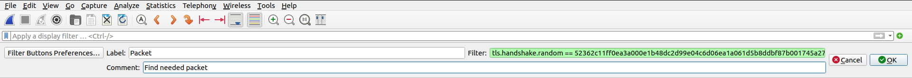
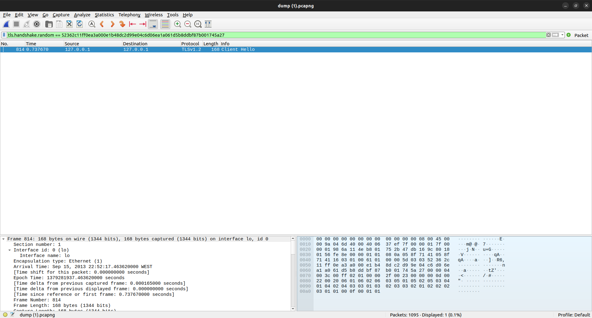
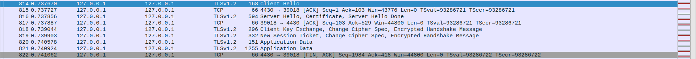
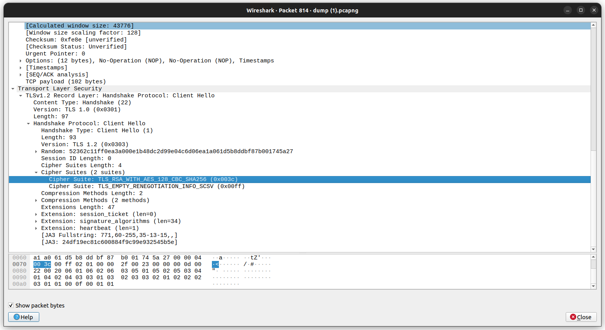
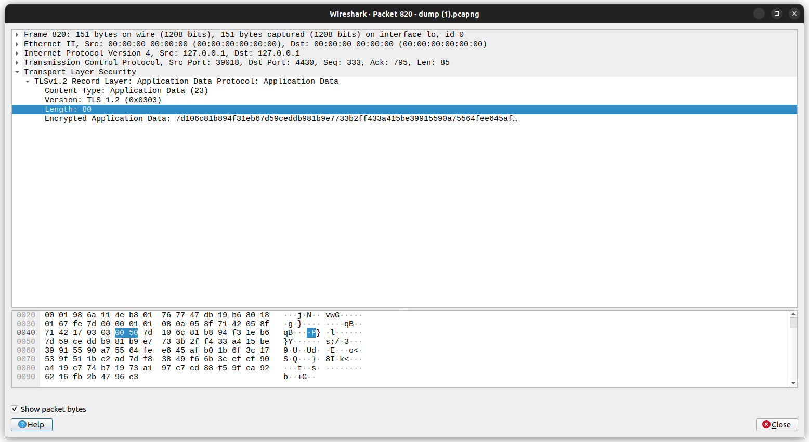
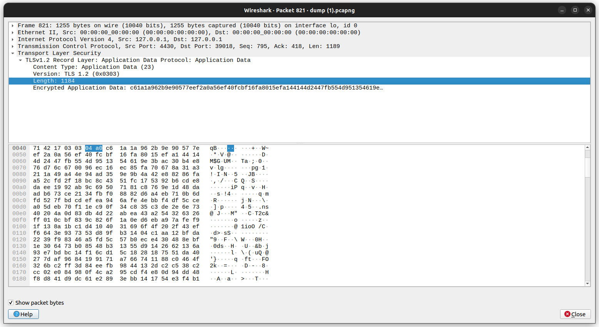
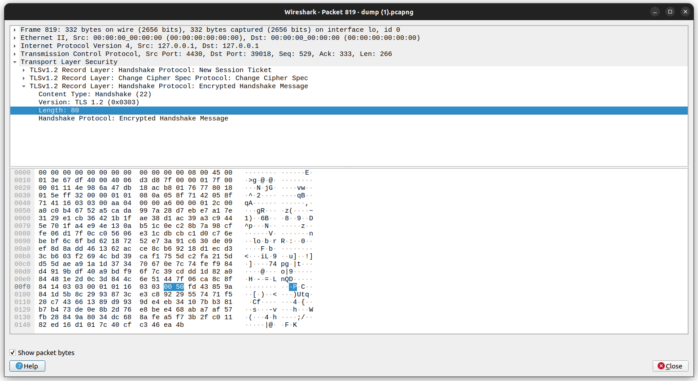

# Find My TLS

## CTF Week 13

### The challenge

In this week's challenge we are provided a dump.pcapng which contains a lot of TLS connections. TLS stands for Transport Layer Security and is a cryptographic protocol used to secure communications over a computer network. It is used to secure web traffic, email, instant messaging and many other applications.

The challenge is to construct the flag from information that can be found in the file using Wireshark. The flag has the following format: 
```
flag{<frame_start>-<frame_end>-<selected_cipher_suite>-<total_encrypted_appdata_exchanged>-<size_of_encrypted_message>}
```

### The solution

First we are told that we should look for a packet where the random value in the Client Hello message is `52362c11ff0ea3a000e1b48dc2d99e04c6d06ea1a061d5b8ddbf87b001745a27`. We can do this by using the filter `tls.handshake.random == 52362c11ff0ea3a000e1b48dc2d99e04c6d06ea1a061d5b8ddbf87b001745a27`.




After finding that the TLS handshake starts in the packet 814, we can go back to the general view to see the whole TLS handshake and observe that it ends in the packet 819, after sending the New Session Ticket packet.



With this information we can know that the flag starts with `814-819-`.

Now we need to find what cipher suite was used. We can do this by looking at the Client Hello message (packet 814) and see that the cipher suite used is
`TLS_RSA_WITH_AES_128_CBC_SHA256 (0x003c)`.



We can now add this to the flag: `814-819-TLS_RSA_WITH_AES_128_CBC_SHA256-`.

Now we need to find the total size of the encrypted appdata exchanged. For this we can look at the Application Data packets that were exchanged after the TLS handshake. We can see that there are 2 packets, one with size 80 and the other with size 1184. The total size is 1264.




We can now add this to the flag: `814-819-TLS_RSA_WITH_AES_128_CBC_SHA256-1264-`.

Finally, we need to find the size of the encrypted message. We can do this by looking at the last packet of the TLS handshake, the New Session Ticket packet (packet 819). We can see that the size of the encrypted message is 80.



Adding this to the flag, we get the final flag: 

`flag{814-819-TLS_RSA_WITH_AES_128_CBC_SHA256-1264-80}`
