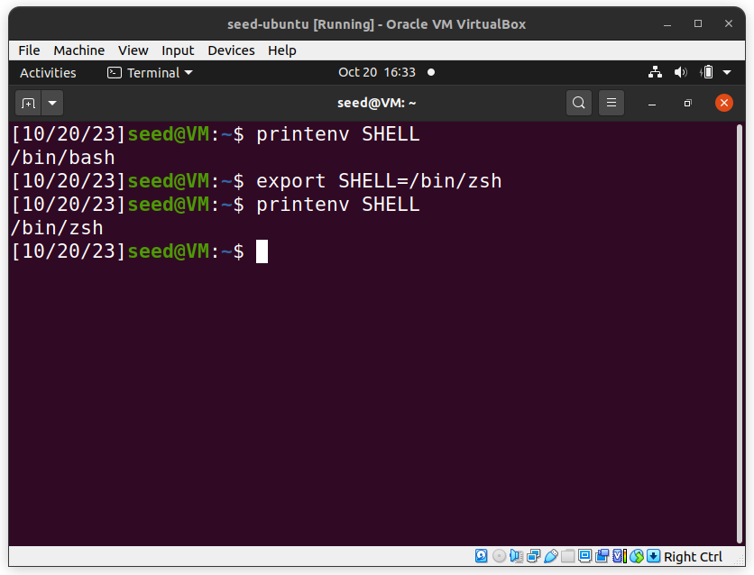
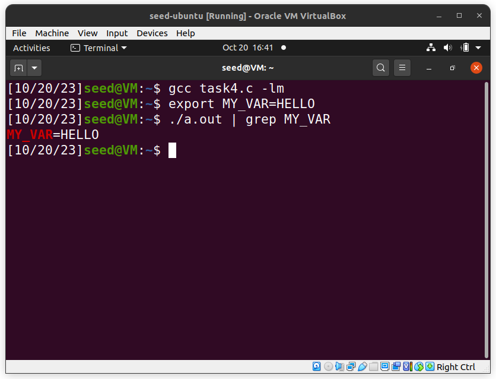
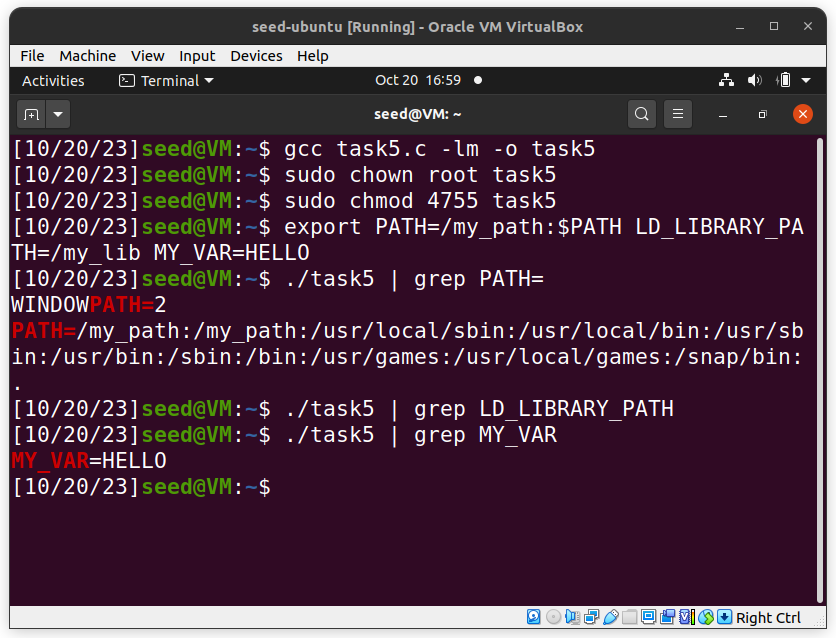
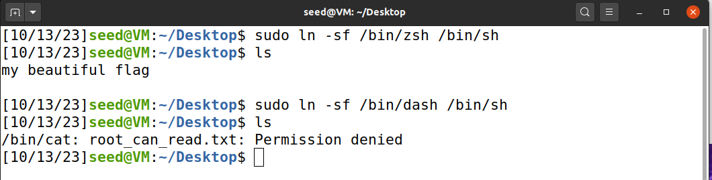

# Environment variabls and SetUID (seed labs)
This is the logbook for the Environment_Variable_and_SetUID guide from seedlabs.

### Task1
We tested several commands to print environmental variables (printenv, printenv X, env), to set them using export (e.g. export MY_ENV_VARIABLE=HELLO_WORLD), and to unset them (unset X)

### Task 2
In this task, we concluded that, using fork(), the parent's environment variables are inherited by the child. In fact, we tested the program by printing the child and then the parent's environment variables, and saving the output to files. We checked that the files had no difference.

### Task 3
The command execve() replaces our program with the new program. The first program we are asked to run has the third parameter of execve as NULL, meaning NULL environment variables. As a consequence, the command "env" executed has no output.
After changing the third parameter to be the environment variables of the original program, these will now also be present in the new program. Therefore, the output from "env" is a list of those environment variables, common to both programs.

### Task 4
As referenced in the guide, system does not directly execute the command like execve(). It asks the shell to execute the command. It uses execl() to execute the shell, which passes the environment variables to the shell. So, the environment variables in a system() call are maintained, which is shown by the output of the program given in the guide.

### Task 5
In this task, we learned the effects of a setuid program.
By changing the program to be owned by root and making it a setuid program ("chmod `4`755"), we make it run with the owner's privilege (root), independently of the user that is running the program.
We can affect the program output from the outside, by modifying the environment variables. Changing "PATH" and creating our own variable "MY_VARIABLE" worked as expected and it appeared in the program. However, "LD_LIBRARY_PATH" did not appear in the output.
In the guide, it is explained that a new child process is created, but as seen here, not all variables from the parent (shell) are passed to the child, a setuid process.

### Task 6
Using system() in setuid programs is dangerous, because of the way environment variables affect the program. Being a setuid program, it runs with its owner's privileges, so any user can change the environment variables to try to modify the program's behaviour.
In this example, we add a directory to the beginning of PATH. By running system("ls"), the first directory to search will be the one at the beginning of PATH. Therefore, by introducing our code in that directory, we'll be executing that code instead of the usual "ls" code.

- We tested doing this and replacing ls for a simple print "Hello World"

- Using different shells dash or zsh does not change the output for this simple program (since it does not require any special permissions)

- If we try to execute some malicious code, as explained in the guide, dash prevents our attack (e.g. try to read a flag) by changing the EUID (effective UID) to the RUID (real UID), dropping the privilege. This can be seen in the following screenshot.

Note that the .txt file in question is owned by root and has "700" permissions

