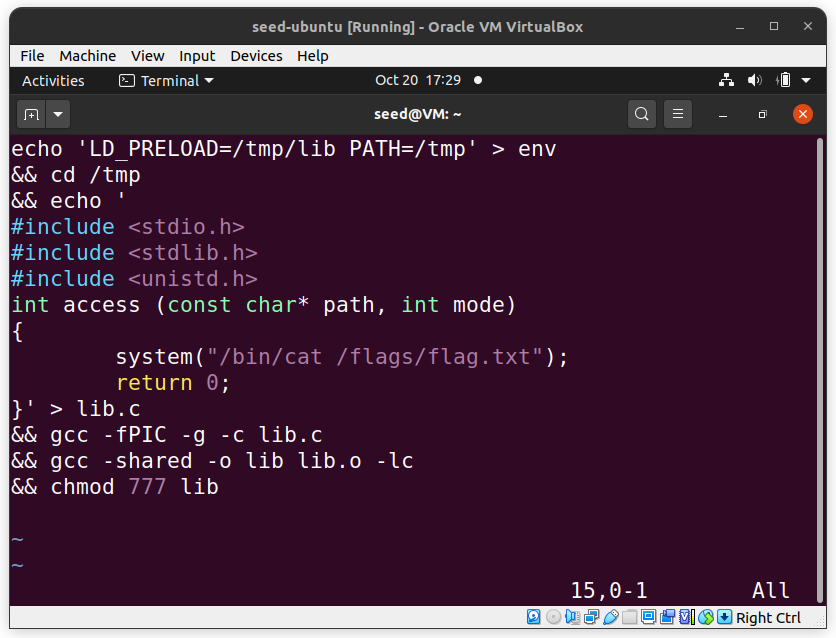

## CTF Linux Environment

This is the logbook for the Linux Environment CTF.

### Start

Starting out, we tried to get as much information from the
`/home/flag_reader` directory.

We read all possible files using cat, such as `main.c`, `my_script.sh`, `admin_note.txt`.

Also, after checking the permissions, we tested running `./my_script.sh` and `./reader`. We concluded reader was `main.c` compiled.

### Affecting program execution/output

By reading `my_script.sh`, we discovered that if we put some variables in `env`, they will be read as environment variables for the `my_script.sh` program. This script also executes the reader binary in /home/flag_reader.

Furthermore, reading `admin_note.txt` led us to search for the `/tmp` folder and the permissions to write in it.
So, we wrote an exploit which consists in a sequence of shell commands that changes the `LD_PRELOAD` environment variable and writes and compiles a library with our own implementation of the `access` function.

After this, we ran `my_script.sh`, effectively changing the behaviour of the program, but we could not get the flag, because we did not have the permissions to read it (we got a permission denied error by the `cat` program).



### Concluding and reading /flags/flag.txt

After reading the CTF's statement again and checking tips for the tasks, we finally concluded that we should check the scheduled processes in the system.

After browsing the Internet for where to find scheduled processes in the system, we found `/etc/cron.d/`, which had the crucial command that runs every minute in the system, with `flag_reader` privilege. This is the privilege needed to read the flag.

```bash
* * * * * flag_reader /bin/bash -c "/home/flag_reader/my_script.sh > /home/flag_reader/last_log"
```

We just had to redirect the output to a file we could read, make `flag_reader` have write permissions on that file and wait for the script to run. We ended up crafting the following exploit:


After doing this and waiting for the minute to pass so the script would run, we obtained the flag:


