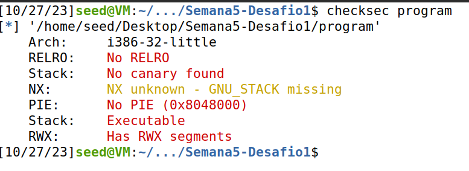
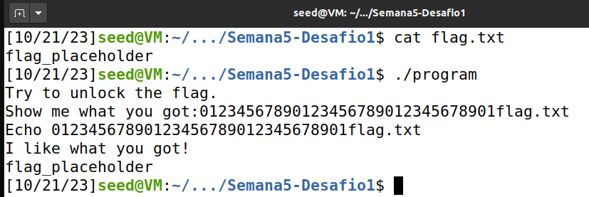
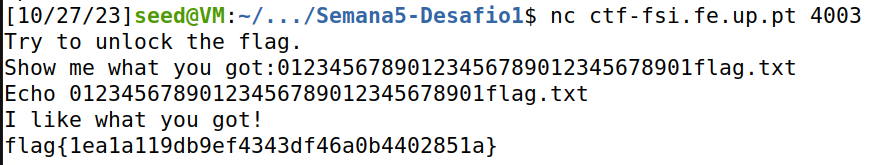
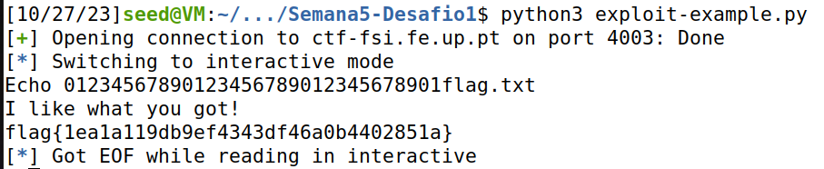
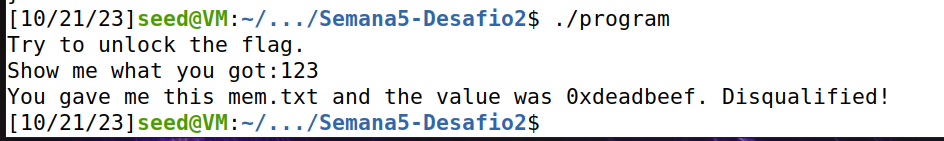
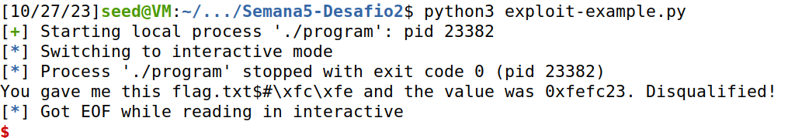
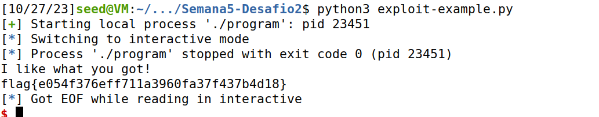

# CTF buffer overflow

Starting out, we explored the files given in the CTF (zip file). We read all possible files using cat: `main.c` and `exploit_example.py` were the useful ones. Analysing the code from main.c and testing "program", we concluded that "program" was main.c compiled.

We also read the exploit_example.py file. Using the library `pwn`, it connects to the remote server (or just to our local file if in debug mode), reads input from the server until ":", sends a line in binary and prints the output given by the server.
```python
r.recvuntil(b":")   # reads input until ":" ("Show me what you got:")
r.sendline(b"Tentar nao custa") # sends line in binary
r.interactive()     # prints output given by the server
```

## Challenge 1
We start by running checksec program. This program checks the security features of the binary.



### Analysis of the program
In the first challenge, the program (main.c) has 2 local buffers, one with 32 characters (buffer) and another with 8 characters (meme_file).
It reads 40 characters from stdin and then opens a file with the name given in the buffer "meme_file" to read.
It opens the file "mem.txt" and reads it.

At first glance, there is no way to control the file read, since it does not come from our input. However, since it reads a up to 40 characters and saves the information inside a buffer of only size 32, we can overflow the buffer and overwrite the file name.
In fact, 8 characters (40 - 32) actually overflow, so we can overwrite the file name with "flag.txt".

### Overflowing the file name
So, we just need to put arbitrary first 32 characters to fill the buffer of 32 characters and 8 characters corresponding to the file we want to open (which will overflow to "meme_file").
- e.g.: 01234567890123456789012345678901flag.txt

This does not require the python script to be used, since we can just use the terminal to send the input to the server using netcat (no binary conversion needed). It is only needed for the second challenge.

Here we present the output of the program when running in the VM:



We can do the same in the server:

<!---->



We can also do this using the python file.
```python3
r.recvuntil(b":")
r.sendline(b"01234567890123456789012345678901flag.txt")
r.interactive()
```
To run, we just do
```bash
python3 exploit.py
```
This results in:



## Challenge 2

### Changes from the first program (main.c)
In the second challenge, the program now reads up to 45 characters from stdin and then opens the same file. However, a new buffer was inserted before the file name, with 4 characters. Another change was the buffer for the file name now having 9 characters instead of 8.
There is also a new check using the new buffer of 4 characters, which checks if those 4 bytes are equal to a certain value. If they are, the file is opened and read.
Finally, if the value is not equal to the expected value, the program prints the file name and that value.

### Problem Mitigation
This does not completely mitigate the problem. Overflow is still possible and we can write over the file name buffer and this new buffer (we can write 45 characters and the buffers have size 32 + 9 + 4 = 45 bytes).

### Running the program and checking the output
Firstly, we started by running the program with values that do not overflow, to check the output of the program.



With this output, we learned that the value of the buffer given in main.c ("\xef\xbe\xad\xde") resulted in 0xdeadbeef, because of little-endianess.


### Overflowing the buffer and reading the flag
Based on the solution for the first challenge using the python file, we expected to just append the values \x24\x23\xfc\xfe to the end of the input to make the if clause pass. These last bytes should overflow to the additional "val" buffer.

These values come from this line presented here, but in little-endian.
```c
if(*(int*)val == 0xfefc2324) {
```

So we started by using this script to send the input to the program:
```python3
r.recvuntil(b":")
r.sendline(b"01234567890123456789012345678901flag.txt\x24\x23\xfc\xfe") # 
r.interactive()	# See flag?
```
We ran:
```bash
python3 exploit.py
```
This connects to the server and sends the input given in "sendline".



However, as seen in the screenshot, this does not work. The value in the "val" buffer is close to the expected one missing only the byte 0x24.
We realised that we made a mistake in filling the meme_file buffer, which is now 9 bytes long. The 0x24 byte was filling that last byte of the buffer, so we needed to add another byte to the input before the "\x24\x23\xfc\xfe".

The final python script to execute is presented here:
```python3
r.recvuntil(b":")
r.sendline(b"01234567890123456789012345678901flag.txt\0\x24\x23\xfc\xfe")   # flag.txt\0 for the meme_file
r.interactive()	# See flag
```

By sending this, the first 32 bytes will fill the first buffer, "flag.txt\0" will fill the second and the "val" buffer will have the correct value. Indeed, the if clause will pass (the int value of "val" will be 0xfefc2324 because of little-endianess). Also, flag.txt will be the file that is read, because of the overflow to "meme_file" (meme_file = "flag.txt\0").
Therefore, the contents of flag.txt will be printed and we can see the flag.

We run
```bash
python3 exploit.py
```
and get the flag:



